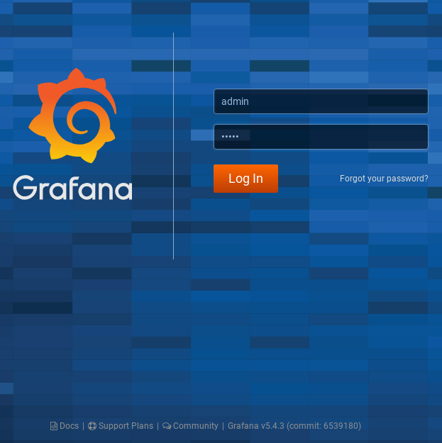
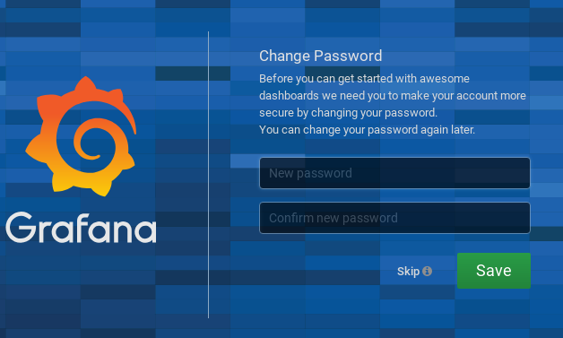
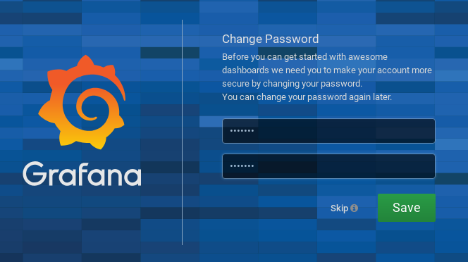
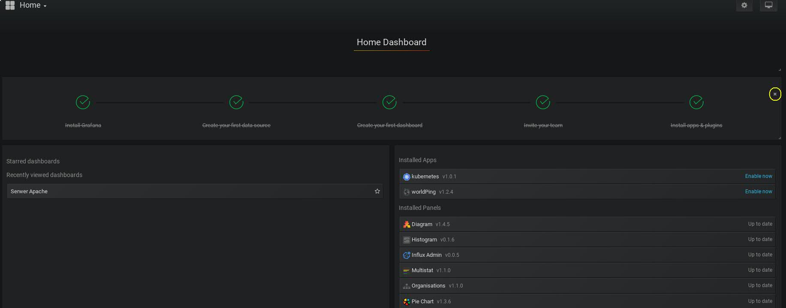

# Ćwiczenie 1

## Cel

Celem ćwiczeń jest omówienie podstawowych funkcji systemu grafana. W tej części dowiesz się w jaki sposób zalogować się do grafany oraz jak jej używać.
Zmienisz domyślne hasło użytkownika "admin".

## Wprowadzenie

Grafana jest złożonym systemem służącym do prezentacji danych w postaci wykresów. Głównym zadaniem systemu jest wizualizacja różnego rodzaju danych. Nazywanie Grafany systemem monitorującym jest błędem. Grafana sama w sobie nie ma możliwośći monitorowania systemów, aplikacji i innych komponentów infrastruktury IT. Dopiero w połączeniu z takimi rozwiązaniami jak Prometheus, CollectD, StatsD, Telegraf, InfluxDB, CloudWatch, Elasticsearch, SNMP i wiele innych tworzy całość. System charakteryzuje się wyjątkowo przyjemnym interfejsem użytkownika. Nie zabrakło tu również narzędzi ułatwiających automatyzację zadań oraz wstępną inicjalizację produktu. Na publicznym githubie znajdziecie nie jeden playbook w ansible, który jest w stanie załatwić wiele spraw. API, które oferuje Grafana w żaden sposób nie odstaje od interfejsów dostępnych w innych tego typu systemach. System dostępny jest na wiele platform w tym docker, kubernetes. Wiele firm oferujących usługi Cloud posiada  Grafanę w swojej ofercie jako jedną z możliwości monitorowania infrastruktury. Na chwilę obecną jest to jedno z najmocniejszych tego typu narzędzi na rynku. Na przestrzeni lat system bardzo mocno ewoluował. Najnowsza wersja robie spore wrażenie pod kątem możliwości, elastyczności prostoty oraz wyglądu. Jest to system wyjątkowo przyjzany użytkownikowi. Zachęcam do dalszej lektury.

## Elemnty labotatorium

Tu znajdziecie ogólny zarys wymagań oraz elementów ćwiczenia:

+ Kontenery
  * vm-grafana

## Weryfikacja kontenerów oraz poszczególnych elementów laboratorium:

Po zalogowaniu na serwer z dockerem z poziomu użytkownika studentvmvm wpisujemy:
```
docker ps | egrep "vm-grafana"
5d4afa777fdf        crcdevops/grafana:latest       "/run.sh"                23 hours ago        Up 22 hours         3001/tcp, 0.0.0.0:3001->3000/tcp   vm-grafana

```

*Jeżeli kontener nie wystartował lub nie jest uruchomiony zwróć się o pomoc do instruktora*

Wylistuj zawartość katalogu: "/home/studentvm/lab/cwiczenia/1"

```
drwxrwxr-x. 3 studentvm studentvm 4096 Mar  5 15:00 .
drwxrwxr-x. 4 studentvm studentvm 4096 Mar  5 15:00 ..
-rw-rw-r--. 1 studentvm studentvm 2388 Mar  5 14:59 cwiczenie1.md
drwxrwxr-x. 2 studentvm studentvm 4096 Mar  5 15:00 src
-rwxrwxrwx. 1 studentvm studentvm  427 Feb 26 10:58 wykonaj.sh

```

Jeżeli zawartość jest zgodna można przejść do cześci praktycznej ćwiczenia.

## Pierwsze logowanie do Grafany

Pierwsze logowanie do grafany wymaga zmiany hasła użytkownika "admin". Jest to użytkownik serwisowy dostarczony w trakcie instalcji.

Postępuj zgodnie z poniższą instrukcją:

W oknie przeglądarki wpisz następujący adres url:

http://grafana:3000

(Domyślny port, na którym nasłuchuje grafana to 3000. Możemy to dowolnie zmieniać modufikując plik grafana.ini. Dobra praktyka nakazuje ukryć serwis za serwerem proxy i komunikacje dodatkowo zabezpieczyć ssl.

Logujemy się z użyciem następujących danych:


| Login | Hasło |
|-------|:-----:|
| admin | admin |


Ekran logowania :



```
Uwaga! Ekran ten może się róźnić w zależności od wersji, która zostanie użyta. W tym laboratorium korzystamy z
wersji 5.4.3. Pojawiła sie już najnowsza wersja w ramach zadania dodatkowego można ją zainstalować. Nie mniej jednak
nie jest to przedmiotem tego ćwiczenia więc zadanie można potraktować jako dodatkowe.
```

Nowe hasło użytkownika:


| Login | Hasło   |
|-------|:-------:|
| admin | crc2019 |

## Zmiana hasła dla użytkownika "admin"


<br/><br/><br/>


Po kliknięciu "Save" powinniśmy zostać przeniesieni do głownego dashboardu grafany. Aby pozbyć się go należy kliknąć przycisk "X" co ilustruje poniższy zrzut ekranu. Home dashboard nie będzie nam już potrzebny ponieważ bedziemy definiować własne.




### Jeżeli z jakiegoś powodu nie byłeś w stanie wykonać tego ćwiczenia użyj skryptu:
```
~./cwiczenia/1/wykonaj.sh

```


[](../../cwiczenia/2/cwiczenie2.md)
