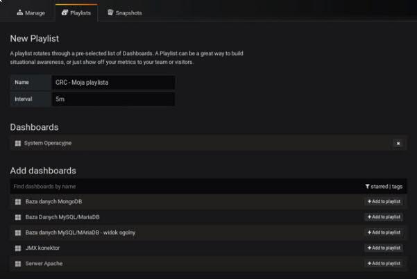

# Cwiczenie 10

## Cel
W ćwiczeniu dowiesz się jak w prosty sposób utworzyć własną playlistę. Powiemy do czego można wykorzystać playlisty w codziennej pracy.

## Elemnty labotatorium

Tu znajdziecie ogólny zarys wymagań oraz elementów ćwiczenia:

+ Kontenery
  * vm-grafana

## Co to są playlisty?
Playlisty/playlista jest to nic innego jak prezentacja poszczególnych dashboardów. Prezentowane dashboardy pojawiają się na ekranie z określoną czestotliwością. Playlista ma sens pod warunkiem, że użyto w niej dashboardów, które nie są większe niż ekran monitora. W przypadku ekranów wykraczających poza obszar monitora wymagane jest przewijanie. Playlista idealnie nadaje się dla zespołu, który monitoruje pracę naszych systemów 24x7. Można zbudować np kilka playlist i wyświetlać je na różnych monitorach
jednocześnie.

## Jak można je wykorzystać w coodziennej pracy?
Playlisty maja służyć jako monitory czasu rzeczywistego dla zespołów, które zajmują się doglądaniem systemów. W przypadku gdy dochodzi do awarii zostaną wyświetlone zdarzenia, które wymagają natychmiastowej reakcji np. brak prądu, utrata redundancji, zepsuty serwer itp.

## Kliknij na link poniżej by prześledzić w jaki sposób utworzyć playlistę:

Zachęcam was do eksperymentów. Spróbujcie swoich sił i utwórzcie kilka playlist. Każda z nich może być wyświetlana zupełnie inaczej.

