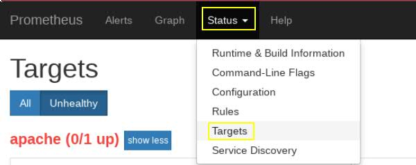

# Cwiczenie 11

## Cel
W ćwiczeniu dowiesz się jak rozszerzać konfiguracje prometheus o dodatkowe nody. Jak skonfigurować monitoring dla serwera apache oraz mongodb.


## Elemnty labotatorium - wymagania

Tu znajdziecie ogólny zarys wymagań oraz elementów ćwiczenia:

+ Kontenery (muszą być uruchimione)
  * vm-grafana
  * vm-mongodb
  * exp-mongodb
  * vm-apache
  * exp-apache
  * vm-prometheus


+ Prawidłowo wykonane:
  * cwiczenie 1
  * cwiczenie 2
  * cwiczenie 3

+ Maszyna Softlayer:
  * adres IP
  * wpis w /etc/hosts na komputerze z której się łączymy

## Co to jest Prometheus oraz jak go używać
Prometheus to rozbudowany system monitorowania zbudowany w oparciu o jezyk Go. System został zbudowany w firmie Sound Cloud a następnie projekt został przeniesiony do Google. Obecnie to jest częścią CNCF. Więcej informacji na temat Prometheusa znajdziecie pod adresem: https://prometheus.io/. System ten charakteryzuje się przede wszystkim:

- dane wielowymiarowe (metryki opierające się o etykiety klasyfikujące dane);
- własny język zapytań (PromQL) niezwykle szybki, dający możliwości
  natychmiastowej wizualizacji;
- wiele dostępnych integracji w tym Grafana;
- wyjątkowo szybki dostęp do danych, dane przechowywane na dysku jak i w pamięci operacyjnej;
- różne notacje (python, Go);
- bardzo prosta implementacja;
- mnóstwo klientów oraz dostępnych bibliotek;
- duża elostyczność zarówno pod kątem pisania własnych rozszerzeń jak i integrowania z istniejącymi
  systemami.

Poniżej lista firm korzystających z Prometheus:


## Konfiguracja serwera
Używając komendy docker podłącz się do kontenera vm-prometheus:

```
docker exec -it --user root vm-prometheus sh
```
Do pliku /etc/prometheus/prometheus.yml dopisz następującą konfigurację:

```
# node exporter for vm-apache (separate docker container)
- job_name: 'apache'
  scrape_interval: 5s
  static_configs:
  - targets: ['exp-apache:9117']

# node exporter for vm-mongodb (separate docker container)
- job_name: 'mongodb'
  scrape_interval: 5s
  static_configs:
  - targets: ['exp-mongodb:9001']
```


 Pamiętaj by zachować właściwe wcięcia (plik yml)! Jeżeli z jakiegoś powodu nie jesteś w stanie zmienić konfiguracji pliku /etc/prometheus/prometheus.yml np. pojawi się komunikat read only to zmiany dokonaj w pliku */home/studentvm/lab/prometheus/conf* serwerze gdzie docker jest uruchomiony (maszyna Softlayer)

```
$ pwd
/home/studentvm/lab/prometheus/conf
$ ls -la
total 20
drwxrwxr-x. 2 studentvm studentvm 4096 May  7 11:10 .
drwxrwxr-x. 4 studentvm studentvm 4096 May  7 11:10 ..
-rw-rw-r--. 1 studentvm studentvm 2480 May  7 11:10 crc-rules-docker.yml
-rw-rw-r--. 1 studentvm studentvm  203 May  7 11:10 mq-targets.yml
-rw-rw-r--. 1 studentvm studentvm 2138 May  7 11:10 prometheus.yml
$
```

Wyjdź z kontenera wpisując polecenie exit

```
/prometheus # exit
#
```

Zrestartuj kontener vm-prometheus
```
docker restart vm-prometheus
```

Zweryfkuj logi:

```
docker logs vm-prometheus

level=info ts=2019-04-15T13:29:35.00347338Z caller=main.go:691 msg="See you next time!"
level=info ts=2019-04-15T13:29:45.55689354Z caller=main.go:302 msg="Starting Prometheus" version="(version=2.7.2, branch=HEAD, revision=82f98c825a1437c0a24056eb4dc986d9a3fc7fae)"
level=info ts=2019-04-15T13:29:45.557010586Z caller=main.go:303 build_context="(go=go1.11.5, user=root@ab86c672c33a, date=20190302-14:57:04)"
level=info ts=2019-04-15T13:29:45.55706041Z caller=main.go:304 host_details="(Linux 3.10.0-957.1.3.el7.x86_64 #1 SMP Thu Nov 29 14:49:43 UTC 2018 x86_64 vm-prometheus (none))"
level=info ts=2019-04-15T13:29:45.557103974Z caller=main.go:305 fd_limits="(soft=1048576, hard=1048576)"
level=info ts=2019-04-15T13:29:45.557141479Z caller=main.go:306 vm_limits="(soft=unlimited, hard=unlimited)"
level=info ts=2019-04-15T13:29:45.558352887Z caller=main.go:620 msg="Starting TSDB ..."
level=info ts=2019-04-15T13:29:45.572423972Z caller=repair.go:48 component=tsdb msg="found healthy block" mint=1554980504259 maxt=1555005600000 ulid=01D87A27BV6DWBE7B5336DX22D
level=info ts=2019-04-15T13:29:45.575610539Z caller=repair.go:48 component=tsdb msg="found healthy block" mint=1555005600000 maxt=1555070400000 ulid=01D89106YMYVGSKP3F5YSMAX15
level=info ts=2019-04-15T13:29:45.578938488Z caller=repair.go:48 component=tsdb msg="found healthy block" mint=1555070400000 maxt=1555135200000 ulid=01D8AYSMDJPNA6Q55KGV94FKT8
level=info ts=2019-04-15T13:29:45.582507274Z caller=repair.go:48 component=tsdb msg="found healthy block" mint=1555135200000 maxt=1555200000000 ulid=01D8CWK6XWF5JXBRBXDQ19V59B
level=info ts=2019-04-15T13:29:45.594604932Z caller=repair.go:48 component=tsdb msg="found healthy block" mint=1555200000000 maxt=1555264800000 ulid=01D8ETCPPA0V19Q01XQ4Z1NZ51
level=info ts=2019-04-15T13:29:45.596070357Z caller=repair.go:48 component=tsdb msg="found healthy block" mint=1555264800000 maxt=1555286400000 ulid=01D8FEZZG8BFRVTEAZVD44V8ST
level=info ts=2019-04-15T13:29:45.596817216Z caller=repair.go:48 component=tsdb msg="found healthy block" mint=1555308000000 maxt=1555315200000 ulid=01D8GJHRZNE8BACDGGG50PJY2B
level=info ts=2019-04-15T13:29:45.606628982Z caller=repair.go:48 component=tsdb msg="found healthy block" mint=1555286400000 maxt=1555308000000 ulid=01D8GJJQCGFKH6T8M473T76BKS
level=info ts=2019-04-15T13:29:45.624890514Z caller=web.go:416 component=web msg="Start listening for connections" address=0.0.0.0:9090

```

### WebGui - weryfikacja

W oknie adresu przeglądarki wpisz:


http://twój-serwer:9090/

 Za twój-serwer należy podstawić adres IP lub nazwę serwera w IBM SoftLayer.

#### Weryfikacja obiektów docelowych (targets)

W głównym menu WebGui wybieramy *Status*:


Kolejno *Status* → *Targets*:<br/>


Klikamy *Unhealthy*:<br/>


## Konfiguracja exporterów
W celu ułatwienia wykonania cwiczenia konfuguracje przygotowano wcześniej. Exportery zostały zamknięto w kontenerach. Aby poznać szczegóły konfiguracji i zgłębić wiedzę na temat exporterów zachęcam do analizy następujących katalogów. Można je znaleźć w głównym katalogu repozytorium na
github.
```
[studentvm@<twój_serwer> exporters]$ pwd
/home/studentvm/lab/exporters
[studentvm@<twój_serwer> exporters]$ tree .
.
├── Dockerfile-apacheexp
├── Dockerfile-mariadbexp
├── Dockerfile-mongodbexp
├── Dockerfile-nginxexp
├── Dockerfile-nodeexp
├── Dockerfile-redisexp
├── Dockerfile-tomcatexp
└── prerequisite
    ├── apache
    │   └── apache_exporter
    ├── mariadb
    │   └── env
    │       └── exporter.env
    ├── mongodb
    │   └── mongodb_exporter
    ├── nginx
    │   └── default.conf
    ├── redis
    │   └── bin
    │       └── redis_exporter
    └── tomcat
        ├── config.yml.template
        ├── config.yml.template_delay
        ├── env
        │   └── exporter.env
        ├── jmxremote.access
        ├── jmxremote.password
        ├── local_test_examples
        ├── resources
        │   ├── check_jmx
        │   │   ├── check_jmx
        │   │   └── jmxquery.jar
        │   ├── config_basic.yml
        │   ├── config_no_rules.yml
        │   └── config.yml
        ├── rules
        │   ├── default.yml
        │   ├── kafka-0-8-2.yml
        │   └── spark.yml
        └── start.sh

13 directories, 27 files
```

Należą się krótkie wyjaśnienia: Pliki exporterów są kopiowane bezpośrednio do kontenerów i tam traktowane jako punkty startowe (Entry Points). Domyślna lokalizacja metryk to */metrics*. Można to dowolnie zmieniać. Aby zweryfikować poprawność działania eksporterów należy w przeglądarce otworzyć następujące adresy:

Apache exporter:
http://twoj-serwer:9117/metrics

Mongodb exporter:
http://twoj-serwer:9001/metrics

Jak widać metryki eksponuje wbudowany serwer http.

## Konfiguracja serwera apache
Wymaga modyfikacji pliku konfiguracyjnego serwera apache. Należy pamiętać by rozszerzyć konfigurację o odadkowy moduł. Niezbędna
będzie też rekonfiguracja serwera apache. W naszym ćwiczeniu ograniczymy się tylko do aktywowania konfiguracji a mianowicie
odkomentowania stosownych linijek w pliku status.conf. Więcej informacji znajdziecie w dokumentacji Apache:

https://httpd.apache.org/docs/2.4/mod/mod_status.html

Nie jest to obowiązkowa lektura nie mniej jednak zachęcam do przeczytania.

Logujemy się do kontenera vm-apache
```
docker exec -it vm-apache bash
```

```
root@vm-apache:/usr/local/apache2# cd conf/extra/
root@vm-apache:/usr/local/apache2/conf/extra#
root@vm-apache:/usr/local/apache2/conf/extra# pwd
/usr/local/apache2/conf/extra

root@vm-apache:/usr/local/apache2/conf/extra# cat status.conf
#ExtendedStatus on
#<Location "/server-status">
#    SetHandler server-status
#</Location>

root@vm-apache:/usr/local/apache2/conf/extra# sed -e 's/#//g' status.conf > status.conf-new; cp status.conf-new status.conf; rm status.conf-new

root@vm-apache:/usr/local/apache2/conf/extra# ls -la | grep status
-rw-rw-r--. 1 1000     1000    87 Apr 15 19:39 status.conf
root@vm-apache:/usr/local/apache2/conf/extra# cat status.conf
ExtendedStatus on
<Location "/server-status">
    SetHandler server-status
</Location>

exit
```

Restartujemy kontener vm-apache:

```
docker restart vm-apache

docker logs vm-apache

[Mon Apr 15 19:43:36.209509 2019] [mpm_event:notice] [pid 1:tid 140216075513920] AH00491: caught SIGTERM, shutting down
AH00558: httpd: Could not reliably determine the server's fully qualified domain name, using 10.200.200.41. Set the 'ServerName' directive globally to suppress this message
AH00558: httpd: Could not reliably determine the server's fully qualified domain name, using 10.200.200.41. Set the 'ServerName' directive globally to suppress this message
[Mon Apr 15 19:43:41.967700 2019] [mpm_event:notice] [pid 1:tid 139710566068288] AH00489: Apache/2.4.38 (Unix) configured -- resuming normal operations
[Mon Apr 15 19:43:41.980714 2019] [core:notice] [pid 1:tid 139710566068288] AH00094: Command line: 'httpd -D FOREGROUND'
10.200.200.152 - - [15/Apr/2019:19:43:42 +0000] "GET /server-status/?auto HTTP/1.1" 200 1050
10.200.200.152 - - [15/Apr/2019:19:43:44 +0000] "GET /server-status/?auto HTTP/1.1" 200 1124
10.200.200.152 - - [15/Apr/2019:19:43:49 +0000] "GET /server-status/?auto HTTP/1.1" 200 1138
10.200.200.152 - - [15/Apr/2019:19:43:54 +0000] "GET /server-status/?auto HTTP/1.1" 200 1134
10.200.200.152 - - [15/Apr/2019:19:43:59 +0000] "GET /server-status/?auto HTTP/1.1" 200 1142
10.200.200.152 - - [15/Apr/2019:19:44:04 +0000] "GET /server-status/?auto HTTP/1.1" 200 1141
10.200.200.152 - - [15/Apr/2019:19:44:09 +0000] "GET /server-status/?auto HTTP/1.1" 200 1146
10.200.200.152 - - [15/Apr/2019:19:44:14 +0000] "GET /server-status/?auto HTTP/1.1" 200 114
```

 Weryfikacja portu serwera http dla kontenera vm-apache:


```
docker ps | grep vm-apache
7c5c717879a1        crcdevops/apache:latest          "httpd-foreground"       4 days ago          Up 2 minutes        8080/tcp, 0.0.0.0:82->80/tcp                                                                                                                             vm-apache
```

W przeglądarce internetowej wpisujemy:

http://twój-serwer:82/server-status


Jak zdążyliście zauważyć moduł serwera http jest widoczny i gotowy do użycia.
To własnie ten adres jest źródłem naszych metryk ;-)

## Konfiguracja mongodb
W przypadku konfiguracji serwera NoSQL mongodb nie trzeba w zasadzie nic robić. Jeżeli chcemy zabezpieczyć komunikację
przy użyciu ssl oraz hasła będziemy musieli uruchomić środowisko Go. Tam dokonać stosownych zmian w kodzie i ponownie zbudować
exporter.


## Weryfikacja - Grafana.
Logujemy się do grafany:

http://twój-serwer:3000

uzytkownik: admin <br/>
hasło:      crc2019

`Uwaga!`<br/>
Należy pamiętać o zaleźnościach. Przed rozpoczęciem procesu weryfikacji dashboardów w Grafanie należy prawidłowo wykonać cwiczenia 1, 2 oraz 3. Aby sprawę ułatwić przygotowano skrypty automatyzujące wykonanie. W katalogu cwiczenia poszukaj i wykonaj skrypt o nazwie wykonaj.sh ;-)

 Skrypty znajdziesz na użytkowniku studentvm w katalogu:

```
$ pwd
/home/studentvm/lab/cwiczenia
$ ls -la 1 2 3
1:
total 24
drwxrwxr-x.  3 studentvm studentvm 4096 Apr 11 06:00 .
drwxrwxr-x. 16 studentvm studentvm 4096 Apr 11 06:00 ..
-rw-rw-r--.  1 studentvm studentvm 4354 Apr 11 06:00 cwiczenie1.md
drwxrwxr-x.  2 studentvm studentvm 4096 Apr 11 06:00 src
-rwxrwxr-x.  1 studentvm studentvm  600 Apr 11 06:00 wykonaj.sh

2:
total 24
drwxrwxr-x.  3 studentvm studentvm 4096 Apr 11 06:00 .
drwxrwxr-x. 16 studentvm studentvm 4096 Apr 11 06:00 ..
-rw-rw-r--.  1 studentvm studentvm 4233 Apr 11 06:00 cwiczenie2.md
drwxrwxr-x.  2 studentvm studentvm 4096 Apr 11 06:00 src
-rwxrwxr-x.  1 studentvm studentvm 2000 Apr 11 06:00 wykonaj.sh

3:
total 28
drwxrwxr-x.  4 studentvm studentvm 4096 Apr 11 06:00 .
drwxrwxr-x. 16 studentvm studentvm 4096 Apr 11 06:00 ..
-rw-rw-r--.  1 studentvm studentvm 6311 Apr 11 06:00 cwiczenie3.md
drwxrwxr-x.  2 studentvm studentvm 4096 Apr 11 06:00 src
drwxrwxr-x.  2 studentvm studentvm 4096 Apr 11 06:00 wczytaj
-rwxrwxr-x.  1 studentvm studentvm  731 Apr 11 06:00 wykonaj.sh
$

```


```
[studentvm@<twój_serwer> ~]$ cd lab/cwiczenia/1;./wykonaj.sh
--------------------- POCZĄTEK ĆWICZENIA ---------------------

####################################################
# Cwiczenie 1 - Zmiana hasła dla użytkownika admin #
####################################################

[studentvm@<twój_serwer> 1]$ cd ../2;./wykonaj.sh admin crc2019

#####################################################################################################
# Cwiczenie 2 - Stworzenie 2 użytkowników administrator, gosc i zapisanie ich do organizacji Grupa2 #
#####################################################################################################

Tworzymy nową organizację:

Organizacja Grupa2 dla użytkownika administrator i gość:
{"message":"Organization created","orgId":3}
------------------------------------------------------

Tworzymy użytkowników:

{"id":4,"message":"User created"}{"id":5,"message":"User created"}
----------------------------------------------------------------------------------

Dodajemu użytkowników do organizacji Firma1:

{"message":"User added to organization"}{"message":"User added to organization"}
Usuwamy użytkownika administratora oraz gosca z organizacji Main Org.:

{"message":"User removed from organization"}{"message":"User removed from organization"}

--------------------- KONIEC ĆWICZENIA ---------------------

--------------------- POCZĄTEK ĆWICZENIA ---------------------

[studentvm@<twój_serwer> 3]$ cd ../3;./wykonaj.sh
--------------------- POCZĄTEK ĆWICZENIA ---------------------

####################################################################
# Cwiczenie 3 - Wczytanie konfiguracji dashboardów w notacji json. #
####################################################################

Skopiuj grafy na vm-grafana:

Zrestartuj kontener vm-grafana:
vm-grafana

Sprawdzam status oraz logi kontenera vm-grafana:
8f68a12a21cd        crcdevops/grafana:latest         "/run.sh"                4 days ago          Up Less than a second   0.0.0.0:3000->3000/tcp                                                                                                                                   vm-grafana

t=2019-04-11T11:01:32+0000 lvl=info msg="Starting Grafana" logger=server version=5.4.3 commit=6539180 branch=HEAD compiled=2019-01-14T14:26:26+0000
.
..
...
t=2019-04-15T20:07:44+0000 lvl=info msg="Starting DB migration" logger=migrator


--------------------- KONIEC ĆWICZENIA ---------------------

```

 Skrypt w cwiczeniu 3 może wykonywać się dłużej niż w poprzednich, proszę uzbroic się w cierpliwość.

#### Monitorowanie apache:

#### Monitorowanie mongodb:

