# Cwiczenie 12

## Cel
W ćwiczeniu dowiesz się jak utworzyć swój własny wzór dashboardu. Do stworzenia
definicji dashboardu wykorzystamy edytor tekstowy Atom lub inny dostępny. Nie ma to większego
znaczenia. Przeprowadzimy, krótką  demonstracje jak monitorować systemy z użyciem
nmon. Dowiesz się również jak w prosty sposób zintegrować narzędzie nmon z grafaną.
W ćwiczeniu do przechowywania danych używamy InfluxDB. Więcej na temat InfluxDB mozna
znaleźć w dokumentacji (https://docs.influxdata.com/influxdb/v1.7/).

## Wstęp
Nmon to narzędzie, które jeste częścią systemu operacyjnego AIX. Mamy też implementacje dla różnych wersji Linuxa. Narzędzie zostało napisane w języku C i jest dostępne na wiele typów procesorów: PSeries, Intel/AMD, ARM. Więcej informacji możecie znaleźć na stronie: http://nmon.sourceforge.net/pmwiki.php?n=Site.Njmon.
NMON dał początek nowemu narzędziu, mowa o NJMON. Można powiedzieć, że NJMON to taka nowoczesna wersja NMONA. NJMON zapisuje
w notacji json więc bardzo łatwo zintegrować go z pythonem. Można przyjąć, że NJMON to narzędzie, któremu bliżej do zapisu w czasie rzeczywistym. W naszym laboratorium będziemy używać NMON'a.

## Elemnty labotatorium - wymagania

Tu znajdziecie ogólny zarys wymagań oraz elementów ćwiczenia:

+ Kontenery (muszą być uruchimione)
  * vm-grafana
  * vm-influxdb
  * vm-nmon
  * vm1-os-nmon
  * vm2-os-nmon
  * vm3-os-nmon

+ Maszyna Softlayer:
  * adres IP
  * wpis w /etc/hosts na komputerze, z której się łączymy (format: <adres IP> <studentvm{wr/kt}.crc.ibm.lab>)

## Uruchomienie środowiska
Nie wymaga od uczestnika dodatkowych aktywności. Przed rozpoczęciem ćwiczenia sprawdź czy wymagane kontenery są uruchomione.
Jeżeli nie skontaktuj się z instruktorem.

## Implementacja dahsboardu dla nmon'a
W katalogu *lab/cwiczenia/cwiczenie12/scripts* uruchom skrypt *linux-nmon.sh*, *grafana.sh*, *influxdb.sh*:

`Uwaga!`<br/>
Wszystkie komendy wykonujemy na maszynie softlayer z użytkownika studentvm. Przejżyj skrypty, żeby mieć wiedzę do czego służą.

```
./linux-nmon.sh
Create dashboard - Linux NMON CRC

{"id":1,"slug":"linux-servers-nmon","status":"success","uid":"He1zkDRWz","url":"/d/He1zkDRWz/linux-servers-nmon","version":1}

./influxdb.sh
Create nmon database:
{"results":[{"statement_id":0}]}
--------------------------------------------------
Show databases:
  % Total    % Received % Xferd  Average Speed   Time    Time     Time  Current
                                 Dload  Upload   Total   Spent    Left  Speed
100   148    0   130  100    18  22723   3146 --:--:-- --:--:-- --:--:-- 26000
{
  "results": [
    {
      "statement_id": 0,
      "series": [
        {
          "name": "databases",
          "columns": [
            "name"
          ],
          "values": [
            [
              "_internal"
            ],
            [
              "monitor"
            ],
            [
              "nmon"
            ]
          ]
        }
      ]
    }
  ]
}
--------------------------------------------------
Create nmon user:
  % Total    % Received % Xferd  Average Speed   Time    Time     Time  Current
                                 Dload  Upload   Total   Spent    Left  Speed
100    89    0    33  100    56    283    480 --:--:-- --:--:-- --:--:--   482
{
  "results": [
    {
      "statement_id": 0
    }
  ]
}
--------------------------------------------------
Give proper credentials for nmon user:
  % Total    % Received % Xferd  Average Speed   Time    Time     Time  Current
                                 Dload  Upload   Total   Spent    Left  Speed
100    70    0    33  100    37   3311   3712 --:--:-- --:--:-- --:--:--  4111
{
  "results": [
    {
      "statement_id": 0
    }
  ]
}
--------------------------------------------------
Show users:
  % Total    % Received % Xferd  Average Speed   Time    Time     Time  Current
                                 Dload  Upload   Total   Spent    Left  Speed
100   113    0    99  100    14  16087   2274 --:--:-- --:--:-- --:--:-- 16500
{
  "results": [
    {
      "statement_id": 0,
      "series": [
        {
          "columns": [
            "user",
            "admin"
          ],
          "values": [
            [
              "nmon",
              false
            ]
          ]
        }
      ]
    }
  ]
}
--------------------------------------------------
Show credentials for nmon user:
  % Total    % Received % Xferd  Average Speed   Time    Time     Time  Current
                                 Dload  Upload   Total   Spent    Left  Speed
100   146    0   118  100    28  12949   3072 --:--:-- --:--:-- --:--:-- 14750
{
  "results": [
    {
      "statement_id": 0,
      "series": [
        {
          "columns": [
            "database",
            "privilege"
          ],
          "values": [
            [
              "nmon",
              "ALL PRIVILEGES"
            ]
          ]
        }
      ]
    }
  ]
}
--------------------------------------------------

./grafana.sh
Create InfluxDB data source for nmon stream:
{"datasource":{"id":5,"orgId":1,"name":"NMON","type":"influxdb","typeLogoUrl":"","access":"proxy","url":"http://vm-influxdb:8086","password":"","user":"","database":"nmon","basicAuth":false,"basicAuthUser":"","basicAuthPassword":"","withCredentials":false,"isDefault":false,"secureJsonFields":{},"version":1,"readOnly":false},"id":5,"message":"Datasource added","name":"NMON"}
--------------------------------------------------
Install clock panel:
installing grafana-clock-panel @ 1.0.2
from url: https://grafana.com/api/plugins/grafana-clock-panel/versions/1.0.2/download
into: /var/lib/grafana/plugins

✔ Installed grafana-clock-panel successfully

Restart grafana after installing plugins . <service grafana-server restart>

--------------------------------------------------
```

W przeglądarce otwórz następujący link: http://twoj-serwer:3000
Zaloguj się do Grafany urzywając następujących danych: admin:crc2019. Po otworzeniu Dashboardu `Linux Server NMON` Dashboard się nie wyświetli. Czemu?

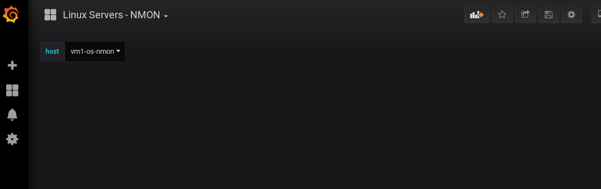

Jak widzicie brakuje nam plugina odpowiadającego za wyświetlanie wykresów kołowych. Należy go zainstalować. Jak to zrobić? Odysłam was do ćwiczenia 4 z sesji I.

lub https://grafana.com/plugins/grafana-piechart-panel

Aby móc zainstalować plugin w grafanie musimy najpierw połączyć się do maszyny vm-grafana używając vagranta.

```
docker exec -it vm-grafana bash
id
uid=472(grafana) gid=472(grafana) groups=472(grafana)
```

 Upewnij się, że jesteś właściwym użytkownikiem.

Instalujemy plugin:

```
grafana-cli plugins install grafana-piechart-panel
installing grafana-piechart-panel @ 1.3.6
from url: https://grafana.com/api/plugins/grafana-piechart-panel/versions/1.3.6/download
into: /var/lib/grafana/plugins

✔ Installed grafana-piechart-panel successfully

Restart grafana after installing plugins . <service grafana-server restart>
```

Każda instalacja nowego plugin wymaga restartu procesu Grafany. Aby plugin pojawił się na liście pluginów zainstalowanych zrestartuj micro serwis vm-grafana.

```
exit
docker restart vm-grafana
docker logs vm-grafana
```

Tak powinny wyglądać logi kontenera vm-grafana po restarcie:

```
t=2019-05-13T13:09:17+0000 lvl=info msg="Registering plugin" logger=plugins name="worldPing Endpoint Nav"
t=2019-05-13T13:09:17+0000 lvl=info msg="Registering plugin" logger=plugins name=worldPing
t=2019-05-13T13:09:17+0000 lvl=info msg="Initializing TracingService" logger=server
t=2019-05-13T13:09:17+0000 lvl=warn msg="[Deprecated] the dashboard provisioning config is outdated. please upgrade" logger=provisioning.dashboard filename=/etc/grafana/provisioning/dashboards/crc.yml
t=2019-05-13T13:09:17+0000 lvl=warn msg="[Deprecated] The folder property is deprecated. Please use path instead." logger=provisioning.dashboard type=file name=default
t=2019-05-13T13:09:17+0000 lvl=info msg="Initializing Stream Manager"
t=2019-05-13T13:09:17+0000 lvl=info msg="HTTP Server Listen" logger=http.server address=0.0.0.0:3000 protocol=http subUrl= socket=
```

Logujemy się do grafany i sprawdzamy rezultaty:


Czy dashboard jest już widoczny? Dla dociekliwych proponuję zajżeć w logi kontenera vm-grafana. Dla jeszcze bardziej dociekliwych:
Zainstalujcie soap ui lub spróbujcie debugować kod strony przy użyciu Chrome Developer Tools.

 Jak objawia się brak danego plugina w Grafana 6.X? Czy jest taki sam efekt jak w Grafanie 5.X?
Czy dashboard się wyświetli? Wnioski?

## Implementacja loadera

Aby móc w pełni cieszyć się wykresami musimy zaimplementować mechanizm zasilania bazy danych. Jak nazywa się wasz data source wiecie? Co to za typ bazy? Jak zweryfikować czy działa?

Uzywając ```docker exec -it vm-nmon bash``` zaloguj się do maszyny vm-nmon.

Wylistuj zawartość cron (użytkownik root):

```
[root@vm-nmon ~]# crontab -l
# NMON import files into InfluxDB:
#*/5   *   *   *   *   /bin/bash -l -c 'source ~/.bash_profile;source ~/.bashrc;/usr/local/nmon-import/bin/nmon_importer' > /dev/null 2>&1
```

Spróbuj aktywować automatyczne zasilenie InfluxDB z użyciem skryptu importera (usuń komentarz).

Zapewne napotkasz na komunikat:

```
crontab: installing new crontab
crontab: error renaming /var/spool/cron/#tmp.vm-nmon.XXXXtEFTkW to /var/spool/cron/root
rename: Device or resource busy
crontab: edits left in /tmp/crontab.EL84Wu
```
Czemu się pojawił? Co jest powodem takiego stanu rzeczy. Jak poradzić sobie z edycją crontaba dla kontenera vm-nmon?
Jeżeli uda Ci sie zmienić konfigurację crontaba dla roota pamiętaj aby zrestartować kontener *vm-nmon*. Bez tego kroku
zmiany nie zostaną wczytane.Ponadto należy zweryfikować uprawnienia pliku */var/spool/cron/root* powinny wyglądać następująco:

```
[root@vm-nmon /]# ls -la /var/spool/cron/root  
-rw-------. 1 root root 105 May 13 21:14 /var/spool/cron/root
```

Spróbuj samodzielnie rozwiązać ten problem. Jeżeli Ci się nie uda poproś o pomoc instruktora.

`Wskazówka`:
Do edycji crontaba dla użytkownika root użyj *vi /var/spool/cron/root*

Jeżeli Ci się udało uruchom skrypt manualnie:

```
/bin/bash -l -c 'source ~/.bash_profile;source ~/.bashrc;/usr/local/nmon-import/bin/nmon_importer' > /dev/null 2>&1
```

W oknie przeglądarki odśwież stronę. Czy widać zmiany?
Jeżeli nie to czemu? Teraz mamy chwilę na trouble shooting.

Przeanalizuj skrypt by znaleźć miejsce składowania logów. Jeżeli skrypt zawiera błędy należy je naprawić.

Log będzie zawierał takie komunikaty:
```
****************************
*** DB IMPORT LINUX DATA ***
****************************
```

Czemu tak jest? Spróbujmy to naprawić.

Otwórz kolejną sesje terminala i używając ```docker exec -it vm[1-3]-os-nmon bash``` Zaloguj się do wszystkich kontenerów gdzie zainstalowany jest klient nmon'a. Wylistuj zawartość cron dla użytkownika root:

```
crontab -l
```

Komenda powinna zwrócić następujące wpisy:

```
# crontab -l
# nmon data collection and housekeeping
0 0 * * * /usr/local/bin/nmon -f -s 30 -c 2880 -T -N -I 0.1 -m /share >/dev/null 2>&1
5 0 * * * /usr/bin/find /share -name "*.nmon" -mtime +1 -exec gzip -9 {} \;
59 23 * * * /usr/bin/find /share -name "*.nmon*" -mtime +30 -exec rm {} \;
```

Zweryfikujmy czy nmon został uruchomiony:

```
# ps -ef | grep -i [n]mon
```

Niestety nie działa. Korzystając z crontab'a uruchamiamy nmona:

```
# /usr/local/bin/nmon -f -s 30 -c 2880 -T -N -I 0.1 -m /share >/dev/null 2>&1
# ps -ef | grep -i [n]mon
root     10072     1  0 13:48 pts/0    00:00:00 /usr/local/bin/nmon -f -s 30 -c 2880 -T -N -I 0.1 -m /share
```

Wykonaj tą operacje na 2 pozostałych mikro serwisach vm2-os-nmon i vm3-os-nmon.

Wymagana jest korekcja uprawnień pliku /var/spool/cron/root. Należy zastosować tą samą procedurę co w przypadku kontenera *vm-nmon*.
Zachęcam do przeglądania logów kontenerów:

```
docker logs vm-nmon
docker logs vm1-os-nmon
docker logs vm2-os-nmon
docker logs vm3-os-nmon
```

Kolejno weryfikujemy zawartość katalogu */share*.
Weryfikacji można dokonać na dowolnym kontenerze nmon ponieważ /share to wolumen współdzielony pomiędzy wszystki kontenery używane w tym ćwiczeniu.

Logujemy się do kontenera vm-nmon:

```
[root@vm-nmon share]# hostname
vm-nmon
[root@vm-nmon share]# pwd
/share
[root@vm-nmon share]# ls -la
total 124
drwxr-xr-x. 2 root root  4096 May 13 19:33 .
drwxr-xr-x. 1 root root  4096 May 13 19:11 ..
-rw-r--r--. 1 root root 36941 May 13 19:36 vm1-os-nmon_190513_1932.nmon
-rw-r--r--. 1 root root 36147 May 13 19:35 vm2-os-nmon_190513_1932.nmon
-rw-r--r--. 1 root root 36144 May 13 19:36 vm3-os-nmon_190513_1933.nmon
```

Jak widać dane pojawiają się cyklicznie co 5 minut.

Odczekaj kolejne 5 minut a następnie zaloguj się do vm-nmon. Kolejno ponownie zweryfikuj log skryptu:

```
# pwd
/usr/local/nmon-import/logs
[root@vm-nmon logs]# ls -la
total 384
drwxr-xr-x. 2 root root     33 Apr 10 07:50 .
drwxr-xr-x. 5 root root     54 Apr 10 07:45 ..
-rw-r--r--. 1 root root 153124 Apr 11 13:51 lab_run_current.out
```

Na samym końcu w pliku powinny zlaleźć się następujące linie:

```
****************************
*** DB IMPORT LINUX DATA ***
****************************

File /share/vm1-os-nmon_190513_1932.nmon imported : 2856 points !
#
File /share/vm2-os-nmon_190513_1932.nmon imported : 5712 points !

File /share/vm3-os-nmon_190513_1933.nmon imported : 3449 points !
```
Świadczy to o tym, że udało się wczytać dane do InfluxDB.

UWAGA!
`Jeżeli z jakiegoś powodu serwis InfluxDB nie odpowiada zrestartuj go.`

```
docker restart vm-influxdb
docker logs vm-influxdb
```

Po chwili nasze wykresy powinny wygladać następująco:

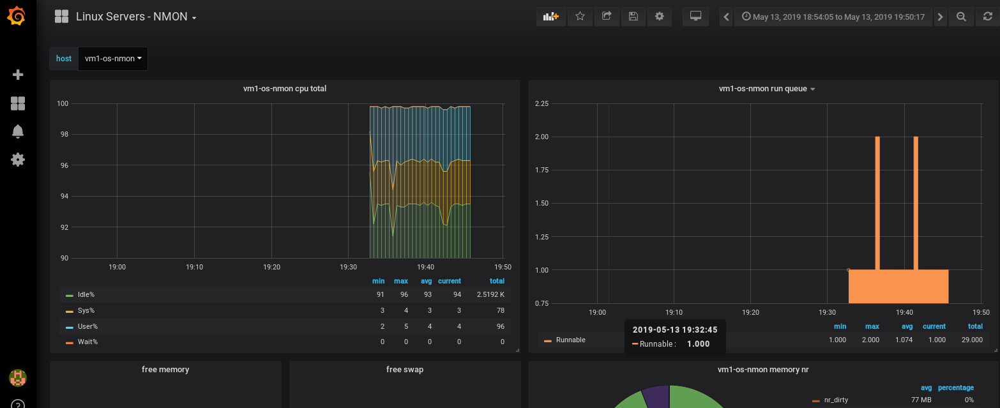

Jeżeli dane w dashboard z jakiegoś powodu są niewidoczne, jeszcze raz przeanalizuj wszystkie kroki. Być może, któryś został pominięty.

## Stress testy

### Instalacja narzędzia stress
Przy użyciu `docker exec -it` zaloguj się do 3 testowych kontenerów (vm1-os-nmon, vm2-os-nmon, vm3-os-nmon). Zainstaluj repozytorium epel:
```
docker exec -it (vm1-os-nmon/vm2-os-nmon/vm3-os-nmon) bash
yum install -y epel-release
Loaded plugins: fastestmirror
Loading mirror speeds from cached hostfile
.
..
...
Installed:
epel-release.noarch 0:7-11                                                           .
..                                                           ...                                          
Complete!
```

Zainstaluj narzedzie stress:
```
yum install -y stress
.
..
...                                                     
Complete!
```

### Stress testy

Przeprowadzamy stress testy zgodnie z poniższymi zaleceniami:

Na kontenerze vm1-os-nmon uruchamiamy narzędzie stress tak aby zająć 90% pamięci. Stress test ma trwać 10 minut. Przed rozpoczęciem testu
zweryfikuj zużycie pamięci. Możesz do tego celu użyć narzędzia nmon lub polecenia free. W moim przypadku polecenie do stress testu wygląda następująco:

```
# stress --cpu 1 --io 4 --vm 1 --vm-bytes 5M --timeout 600s
```

Wartości dla poszczególnych zmiennych mogą się różnić w zależności od wykorzystania pamięci w twoim systemie. `Bądź ostrożny przy nadawaniu wartości dla zmiennej vm-bytes. Błędne oszacowanie i nadanie zbyt dużej wartości może spowodować, że kontener przestanie odpowiadać!`

Na maszynie vm2-os-nmon uruchamiamy narzędzie stress tak aby zajętość procesora wynosiła 99%, stress test ma trwać 15 minut:

Generowane wykorzystanie CPU wedle przepisu:
```
User = 34%
SYS =  75%
```


Aby zasymulować wykorzystanie CPU wedle powyższych kryteriów należy użyć:
```
# stress -c 1 --vm 10M --timeout 900s
```

## Analiza wykresu na podstawie danych wyświetlanych w grafanie.

Do pomiaru aktualnego wykorzystania pamięci i CPU można użyć narzędzia nmon. Jest zainstalowany na wszystkich kontenerach nmon mających w nazwie nmon. Nas interesują tylko vm[1-3]-os-nmon. Aby móc zweryfikować aktualny stan pamięci i CPU zaloguj się na wszystkie 3 maszyny używając (docker exec -it). Kolejno z użytkownika root wykonaj polecenie nmon.

vm1-os-nmon:


vm2-os-nmon:
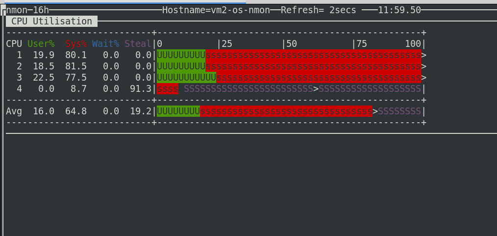

W ramach cwiczenia dodatkowego możesz zweryfikować wykorzystanie zasobów na kontenerze vm3-os-nmon. Wnioski?

Zaloguj się do Grafany:

http://twoj-serwer:3000

(użytkownik admin , hasło crc2019).

Kolejno przejdź do wykresów:


W ramach cwiczenia przeanalizuj wykresy w celu wychwycenia 2 szczytów:

- vm1-os-nmon (ostatnie 30 minut - CPU TOTAL)
- vm2-os-nmon (ostatnie 30 minut)- memory usag)

Wnioski?

Co stanie się gdy wydamy następującą komendę:

```
docker exec -it vm-nmon bash -c "rm -rf /share/*.nmon"
```

Czy pliki zostaną automatycznie odtworzone? Jeżeli nie to jak rozwiązać ten problem?

## Weryfikacja bazy danych oraz danych
Logujemy się do kontenera vm-influxdb:

```
docker exec -it vm-influxdb influx
Connected to http://localhost:8086 version 1.7.4
InfluxDB shell version: 1.7.4
Enter an InfluxQL query
```

Wyświetlamy nasze bazy danych:

```
> show databases
name: databases
name
----
_internal
monitor
telegraf
nmon
nmon_log
```

Łączymy się do bazy danych *nmon*

```
use nmon
```

Wyświetlamy wszystkie dostępne metryki zapisane przez nmon'a

```
> show measurements
name: measurements
name
----
CPU_ALL
DISKBSIZE
DISKBUSY
DISKREAD
DISKWRITE
DISKXFER
JFSFILE
MEM
NET
NETPACKET
PROC
VM
```

Wyświetlamy dostępne szeregi:

```
> show series;
key
---
CPU_ALL,host=vm1-os-nmon,name=CPUs
.
..
...
VM,host=vm3-os-nmon,name=slabs_scanned
```

Zainteresowanych jak używać interfejsu InfluxQL odsyłam do dokumentacji:
https://docs.influxdata.com/influxdb/v1.7/query_language/data_exploration/

## Tworzymy template (json)
Poniżej znajduje się prosty dashboard uwzględniający 1 graf (CPU)

```
{
  "__inputs": [
    {
      "name": "DS_NMON",
      "label": "NMON",
      "description": "",
      "type": "datasource",
      "pluginId": "influxdb",
      "pluginName": "InfluxDB"
    }
  ],
  "annotations": {
    "list": [
      {
        "builtIn": 1,
        "datasource": "-- Grafana --",
        "enable": true,
        "hide": true,
        "iconColor": "rgba(0, 211, 255, 1)",
        "name": "Annotations & Alerts",
        "type": "dashboard"
      }
    ]
  },
  "editable": false,
  "gnetId": null,
  "graphTooltip": 0,
  "id": null,
  "links": [],
  "panels": [
    {
      "aliasColors": {},
      "bars": true,
      "content": "",
      "dashLength": 10,
      "dashes": false,
      "datasource": "${DS_NMON}",
      "editable": true,
      "error": false,
      "fill": 2,
      "gridPos": {
        "h": 11,
        "w": 12,
        "x": 0,
        "y": 0
      },
      "id": 2,
      "leftYAxisLabel": "%",
      "legend": {
        "alignAsTable": true,
        "avg": true,
        "current": true,
        "hideEmpty": false,
        "max": true,
        "min": true,
        "rightSide": false,
        "show": true,
        "total": true,
        "values": true
      },
      "lines": true,
      "linewidth": 1,
      "links": [],
      "mode": "",
      "nullPointMode": "connected",
      "percentage": false,
      "pointradius": 5,
      "points": false,
      "renderer": "flot",
      "seriesOverrides": [],
      "spaceLength": 10,
      "stack": true,
      "steppedLine": false,
      "style": {},
      "targets": [
        {
          "alias": "$tag_name ",
          "dsType": "influxdb",
          "function": "mean",
          "groupBy": [
            {
              "interval": "auto",
              "params": [
                "auto"
              ],
              "type": "time"
            },
            {
              "params": [
                "name"
              ],
              "type": "tag"
            }
          ],
          "groupByTags": null,
          "hide": false,
          "measurement": "CPU_ALL",
          "orderByTime": "ASC",
          "policy": "default",
          "query": "",
          "rawQuery": false,
          "refId": "A",
          "resultFormat": "time_series",
          "select": [
            [
              {
                "params": [
                  "value"
                ],
                "type": "field"
              },
              {
                "params": [],
                "type": "mean"
              }
            ]
          ],
          "tags": [
            {
              "key": "host",
              "operator": "=~",
              "value": "/^$host$/"
            },
            {
              "condition": "AND",
              "key": "name",
              "operator": "=~",
              "value": "/Idle%|Sys%|User%|Wait%/"
            }
          ]
        }
      ],
      "thresholds": [],
      "timeFrom": null,
      "timeRegions": [],
      "timeShift": null,
      "title": "$host cpu total",
      "tooltip": {
        "msResolution": false,
        "shared": true,
        "sort": 0,
        "value_type": "individual"
      },
      "type": "graph",
      "xaxis": {
        "buckets": null,
        "mode": "time",
        "name": null,
        "show": true,
        "values": []
      },
      "yaxes": [
        {
          "format": "short",
          "label": null,
          "logBase": 1,
          "max": null,
          "min": null,
          "show": true
        },
        {
          "format": "short",
          "label": null,
          "logBase": 1,
          "max": null,
          "min": null,
          "show": true
        }
      ],
      "yaxis": {
        "align": false,
        "alignLevel": null
      }
    }
  ],
  "schemaVersion": 16,
  "style": "dark",
  "tags": [
    "Moj dashboard template",
    "NMON",
    "CRC"
  ],
  "templating": {
    "list": [
      {
        "allFormat": "glob",
        "allValue": null,
        "current": {},
        "datasource": "${DS_NMON}",
        "definition": "",
        "hide": 0,
        "includeAll": false,
        "label": null,
        "multi": false,
        "name": "host",
        "options": [],
        "query": "show tag values from \"CPU_ALL\" with key = \"host\"",
        "refresh": 1,
        "regex": "",
        "skipUrlSync": false,
        "sort": 0,
        "tagValuesQuery": "",
        "tags": [],
        "tagsQuery": "",
        "type": "query",
        "useTags": false
      }
    ]
  },
  "time": {
    "from": "now-6h",
    "to": "now"
  },
  "timepicker": {
    "hidden": false,
    "refresh_intervals": [
      "5s",
      "10s",
      "30s",
      "1m",
      "5m",
      "15m",
      "30m",
      "1h",
      "2h",
      "1d"
    ],
    "time_options": [
      "5m",
      "15m",
      "1h",
      "6h",
      "12h",
      "24h",
      "2d",
      "7d",
      "30d"
    ]
  },
  "timezone": "browser",
  "title": "Linux Servers - NMON",
  "version": 1
}
```

Można go znaleźć w katalogu cwiczenia: *cwiczenia/12/wczytaj* lub skopiować i przykleić bezpośrednio jako kod nowo utworzonego dashboardu. Jest kilka możliwość. My wczytamy go za pomocą WebGui:

Uwaga!
Warto zaopatrzyć się w odpowiedni linter. Co to jest linter, innymi słowy validator. Narzędzie pozwalające weryfikować czy składnia pliku jest poprawna np czy wszystkie nawiasy otwarte zostały prawidłowo zamknięte. Jak go zainstalować w Atom? Poniżej kilka screenów obrazujących jak to zrobić z poziomu edytora:

wciskamy kombinacje klawiszy: *ctrl+,*

Odszukujemy jsonlint:

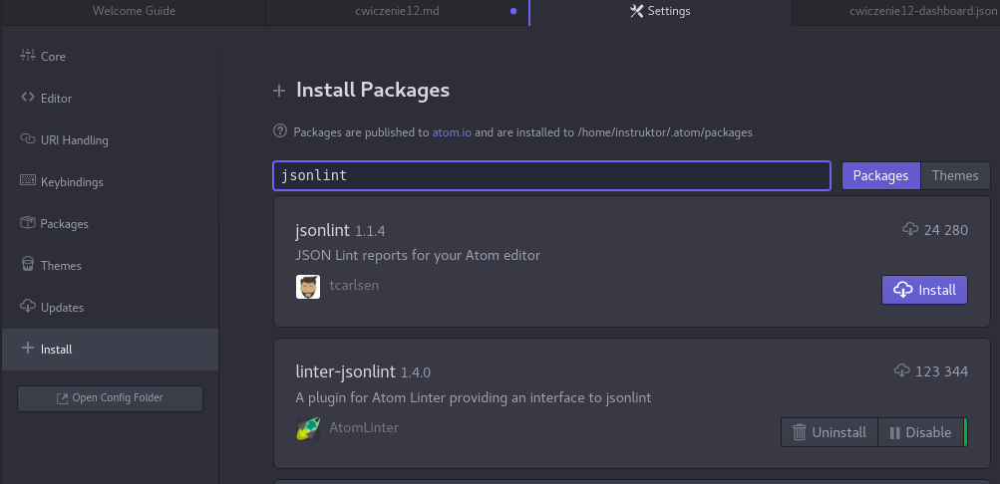

Klikamy przycisk *install* i czekamy. Aby zmiany były widoczne należy zamknąć i otworzyć edytor na nowo.

Wczytujemy json template. Należy go wcześniej pobrać z repozytorium na github a następnie wczytać zgodnie z poniższą instrukcją:

Klikamy *+*, kolejno *Import dashboard*:<br/>


Uzupełniamy pola zgodnie z poniższym screenem:<br/>
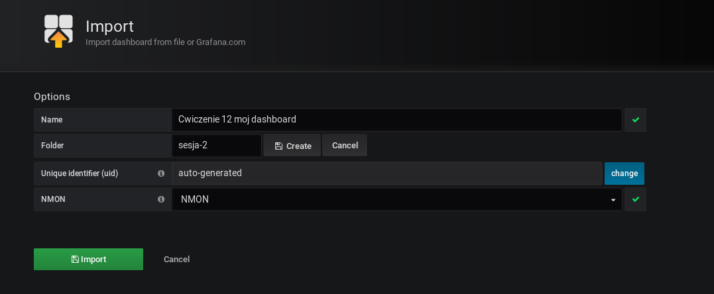

Edytujemy nasz dashboard:<br/>
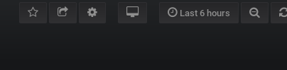

Zmieniamy wartość zmiennej "editable" z false na true (jak widzicie używamy gui, dociekliwi mogą zweryfikować kod):<br/>
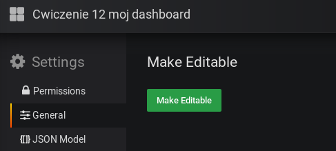


Można dodać opis Docker Monitoring - Cwiczenie 12 ale nie jest to konieczne.
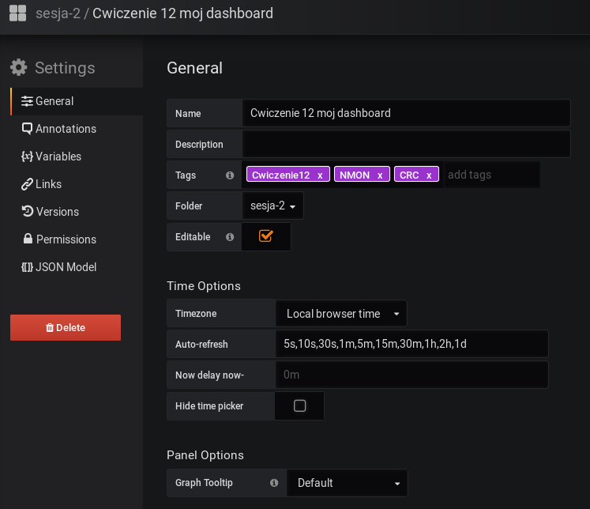

Zapisujemy zmiany z nazwą jak na załączonym screen:
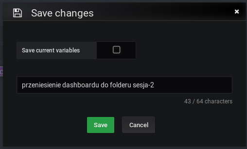

Jak widać dashboard znajduje się teraz w folderze sesja-2:
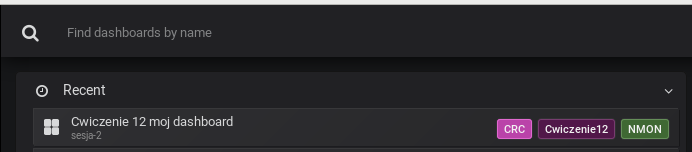

Zmieniamy kolory dla na naszego trendu:<br/>
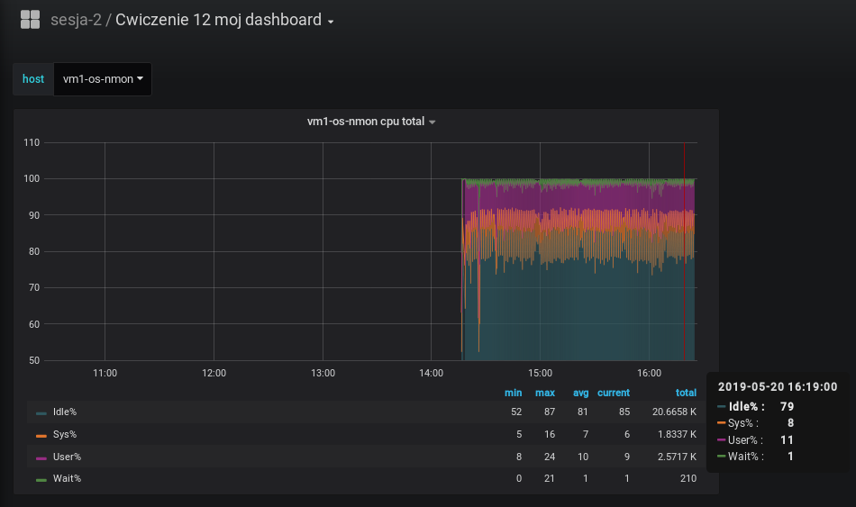

Zapisujemy zmiany pod nazwą "Zmiana kolorów":
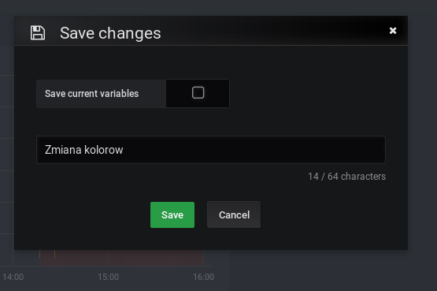

Wykonujemy restore do orginalnej wersji (wybieramy 1 i klikamy restore):
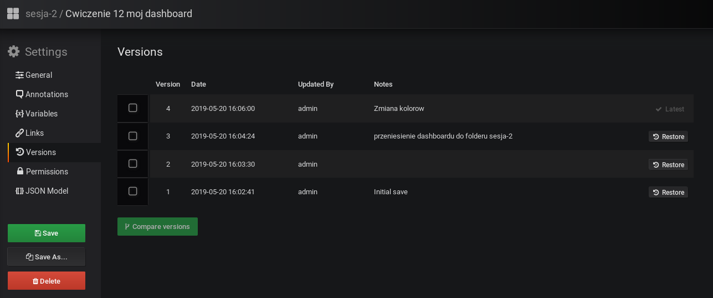

Klikamy "Yes, restore to version 1"<br/>
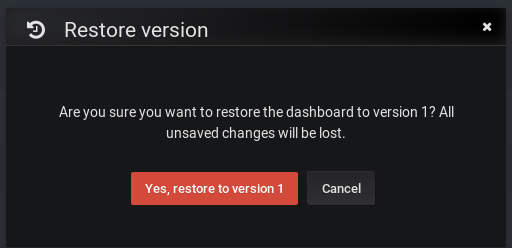

Nasz graf ma postać z przed zmian (wersja initial)

Znajduje się w drzewie głównym dashboardów: "General":
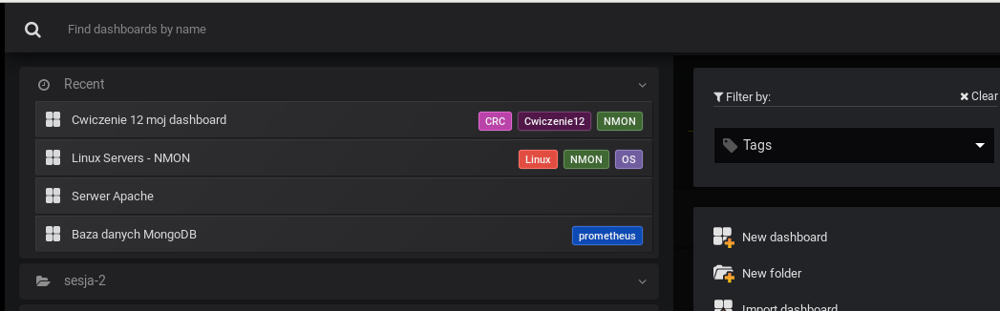

Kolory jak wersja pierwotna:
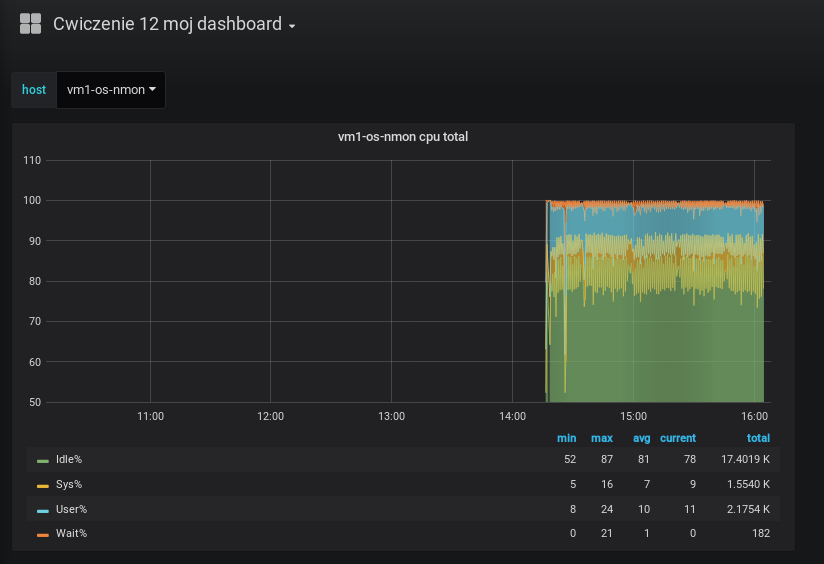

### Przydatne onelinery

#### Uruchomienie nmona na wszystkich kontenerach klienckich
```
for i in 1 2 3; do docker exec -it vm$i-os-nmon bash -c "/usr/local/bin/nmon -f -s 30 -c 2880 -T -N -I 0.1 -m /share/ >/dev/null 2>&1";done
```

#### Sprawdzenie wystąpienia procesu nmon'a na kontenerach klienckich
```
for i in 1 2 3; do docker exec -it vm$i-os-nmon bash -c "hostname;ps -ef | grep [n]mon";done
```
