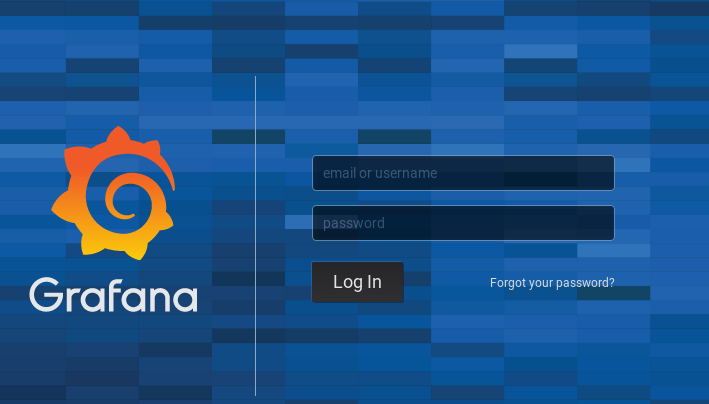
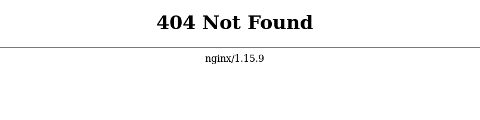
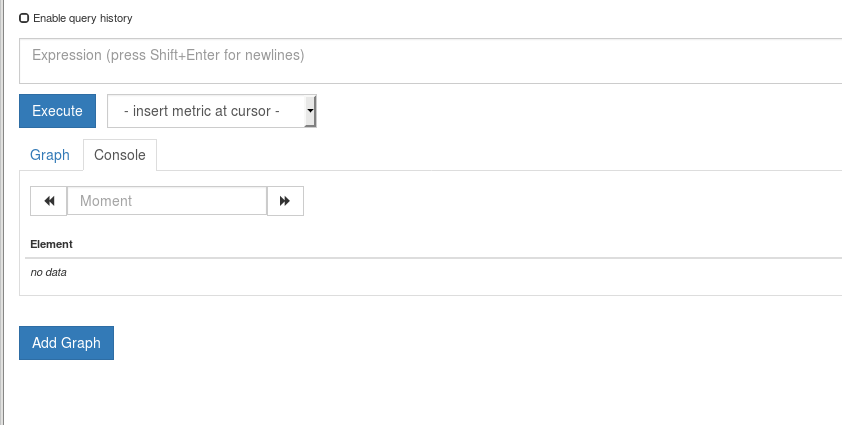

# Cwiczenie 13

## Cel
Celem tego cwiczenia jest skonfigurowanie serwera proxy kluczowych usług używanych we wcześniejszych cwiczeniach. Powiemy sobie czemu warto stosować takie praktyki. Dowiemy się jak skonfigurować reverse proxy dla grafany za pomocą Apache. Nginx posłuży nam jako reverse proxy dla mikro serwisu vm-prometheus. Pokażemy również różnice w konfiguracji i zachowaniu poszczególnych reguł.

## Elemnty labotatorium - wymagania

Poniżej lista elementów wymaganych do wykonania cwiczenia.

+ Kontenery (muszą być uruchimione)

  | nazwa kontenera | porty                                 |
  |-----------------|---------------------------------------|
  | vm-grafana      | 3000/tcp                              |
  | vm-prometheus   | 9090/tcp                              |
  | vm-nginx        | 81/tcp, 443/tcp (standard https)      |
  | vm-apache       | 82/tcp, 444/tcp                       |

## Dodatkowe informacje
Są 2 sposoby na to by udostęponić Grafanę za serwerem proxy:

- sub path
- root path  

Pierwszy z nich sub_path zakłada, że Grafana będzie schowana za konkretnym adresem URI: np. /grafana, /monitoring itp. Drugi sposób zakłada, że Grafana będzie dostępna bezpośrednio po wpisaniu adresu URL: /. Oba rozwiązania mają sens, nie mniej jednak stosowanie sub path jest bardziej zasadne ponieważ za 1 publicznym adresem IP jesteśmy w stani ukryć więcej niż 1 aplikację. Konfiguracja ssl jest opcjonalna ale niesłychanie istotna w przypadku gdy chcemy używać szyfrowanego połączenia. Zastosowanie sub_path wymaga modyfikacji pliku konfiguracyjnego grafany. Więcej informacji znajdziecie pod adresem: https://grafana.com/docs/installation/behind_proxy/. Zmienną root_url będziemy modyfikować w cwiczeniu 14, będzie okazja zobaczyć jak  to wygląda w praktyce. Błędna wartość dla tej zmiennej skutkuje tym, że zamiast strony Grafany wyświetlana jest strona z informacją o błędnej konfiguracji proxy (pomarańczowe litery na białym tle).

## Plan laboratorium
Cwiczenie zostało podzielone na 2 części:

1. Konfiguracja reverse proxy dla grafany z uzyciem serwera Apache. Zastosujemy tutaj sposób bez uwzględniania sub path:

https://twój_serwer:444/

2. Konfiguracja reverse proxy dla prometheusa z wykorzystaniem serwera Nginx. Tu zastosujemy metodę zachowania sub path a mianowicie:

https://twój_serwer/prometheus/

W obu przypadkach ruch będzie szyfrowany.

`Uwaga!`<br/>
*Cwiczenie to zawiera zadania wymagające samodzielności. Wymagana jest wiedza nabyta w poprzednich sesjach w szczególności dobrze opanowany materiał z sesji 3.*

## Uruchomienie środowiska
Nie wymaga od uczestnika dodatkowych aktywności. Przed rozpoczęciem ćwiczenia sprawdź czy wymagane kontenery działają poprawnie. `Jeżeli jakikolwiek kontener nie działa bądź port jest niedostępny skontaktuj się z instruktorem. `

## Konfiguracja reverse proxy dla Grafany z użyciem serwera Apache
Na zdalnej maszynie gdzie uruchomione są kontenery z poziomu użytkownika studentvm zmodyfikuj następujący plik:

`/home/studentvm/lab/apache/conf/httpd-ssl.conf`

Używając ulubionego edytora tekstu usuń komentarz dla linii od 291-294:

```
#ProxyRequests Off
#ProxyPreserveHost On
#ProxyPass /grafana http://vm-grafana:3000
#ProxyPassReverse /grafana http://vm-grafana:3000/grafana
```

Przyjżyj się bliżej konfiguracji apache. Na jakim porcie nasłuchuje Apache? Jak sprawdzić czy usługa działa. Czy jest możliwa modyfikacja pliku konfiguracyjnego bezpośrednio w kontenerze?

Co trzeba zrobić by Apache zarejestrował wyżej wprowadzone zmiany?

Aby zweryfikować czy wszystko zostało zrobione jak należy proponuję z komuptera, na którym pracujecie zweryfikujcie następującą stronę: https://twój_serwer.....
Po ..... należy podać właściwy port oraz URI. Jest to zadanie dla Was. Jak to sprawdzić? Użyjcie wiedzy nabytej w poprzednich cwiczeniach.

```
Jeżeli nie jesteś w stanie dokończyć cwiczenia lub pogubiłeś się skontaktujcie się z instruktorem.
```

Aby sprawdzić czy ćwiczenie zostało wykonane poprawnie w adresie przeglądarki wpisz:

https://<twój_serwer>:444/



## Konfiguracja reverse proxy dla serwera Prometheus - uwzględnienie sub_path.
Z poziomu przeglądarki na komputewrze, na którym pracujecie otwórzcie:

https://twój_serwer

Za *twój serwer* należy podstawić adres IP maszyny gdzie zainstalowany jest docker *(SoftLayer)*



Powyższy screen swiadczy o tym, że serwer Nginx działa i moduł ssl został poprawnie skonfigurowany. W ramach cwiczenia przyjżyjcie się bliżej konfiguracji serwera Nginx:

```
[studentvm@docker02 lab]$ docker exec -it vm-nginx bash
root@vm-nginx:/# cd /etc/nginx
root@vm-nginx:/etc/nginx# ls -laR
.:
total 68
drwxr-xr-x. 1 root root 4096 May 16 09:58 .
drwxr-xr-x. 1 root root 4096 May 16 09:58 ..
drwxr-xr-x. 1 root root 4096 May 16 09:58 conf.d
-rw-r--r--. 1 root root 1007 Feb 26 15:13 fastcgi_params
-rw-r--r--. 1 root root 2837 Feb 26 15:13 koi-utf
-rw-r--r--. 1 root root 2223 Feb 26 15:13 koi-win
-rw-r--r--. 1 root root 5231 Feb 26 15:13 mime.types
lrwxrwxrwx. 1 root root   22 Feb 26 15:13 modules -> /usr/lib/nginx/modules
-rw-r--r--. 1 root root  643 Feb 26 15:13 nginx.conf
-rw-r--r--. 1 root root  636 Feb 26 15:13 scgi_params
drwxr-xr-x. 2 root root 4096 May 16 09:58 ssl
-rw-r--r--. 1 root root  664 Feb 26 15:13 uwsgi_params
-rw-r--r--. 1 root root 3610 Feb 26 15:13 win-utf

./conf.d:
total 24
drwxr-xr-x. 1 root root 4096 May 16 09:58 .
drwxr-xr-x. 1 root root 4096 May 16 09:58 ..
-rw-rw-r--. 1 1002 1002 1194 May 16 09:56 default.conf
-rw-rw-r--. 1 1002 1002  438 May 16 09:56 ssl.conf

./ssl:
total 24
drwxr-xr-x. 2 root root 4096 May 16 09:58 .
drwxr-xr-x. 1 root root 4096 May 16 09:58 ..
-rw-rw-r--. 1 1002 1002 1261 May 16 09:56 server.crt
-rw-rw-r--. 1 1002 1002 1708 May 16 09:56 server.key
```
Jak skonfigurować połącznie ssl dla Apache oraz Nginx odsyłam Was do dokumentacji.

Po przestudiowaniu plików konfiguracyjnych odpowiedzmy sobie na kilka pytań:

1. W jakim pliku mieści się główna konfiguracja dotycząca połączenia ssl.
2. Gdzie mieszczą się certyfikaty ssl?
3. Czy:

```
listen              443 ssl;
```

to to samo co:

```
listen              443;
```

?

Spróbujcie w pliku */home/studentvm/lab/nginx/conf/ssl.conf*

zamienić linię:

`listen              443 ssl;`

na:

`listen              443;`

Zrestartujcie kontener vm-nginx i kolejno przeanalizujcie logi vm-nginx. Widać coś ciekawego? Wnioski? Jakiej komendy należy użyć by zweryfikować bierzące logi uruchomionego kontenera?

`Uwaga!`<br/>
Po wykonaniu powyższej zmiany proszę wrócić do poprzedniej konfiguracji czyli wpisu: `listen 443 ssl;`

### Aktywacja upstream serwerów
Ważną zasadą jest to jest aby tak pisać konfigurację by łatwo można było rozbudować ją o nowe elementy. Poniżej przykład użycia dyrektywy upstream w pliku konfiguracyjnym Nginx'a. Zastanów się czemu własnie taka konfiguracja jest uznawana za najbardziej stosowną?

Aktywujemy konfigurację upstream prometheus serwera:

w pliku */home/studentvm/lab/nginx/conf/ssl.conf* odkomentuj linie od 7 do 8

```
upstream prometheus_server {
    server vm-prometheus:9090;
}
```

### Aktywacja zestawu reguł dla serwera reverse proxy

Do pliku */home/studentvm/lab/nginx/conf/ssl.conf* dopiszcie następujący zestaw lini:

`Uwaga!`<br/>
Jeżeli linie już tam są w celu aktywacji wystarczy je odkomentować

```
location /prometheus/ {
    proxy_set_header Accept-Encoding "";
    proxy_pass http://prometheus_server;
    proxy_redirect off;
    proxy_set_header Host $host;
    proxy_set_header X-Real-IP $remote_addr;
    proxy_set_header X-Forwarded-For $proxy_add_x_forwarded_for;
    proxy_set_header X-Forwarded-Proto $scheme;

    sub_filter_once off;
    sub_filter '="/' '="/prometheus/';
    sub_filter 'var PATH_PREFIX = "";' 'var PATH_PREFIX = "/prometheus";';

    rewrite ^/prometheus/?$ /prometheus/graph redirect;
    rewrite ^/prometheus/(.*)$ /$1 break;
}
```

By zweryfikować poprawność wykonania cwiczenia z poziomu przeglądarki wpisz:

https://<twój_serwer>/prometheus

Powinna zostać wyświetlona strona:




## *** Zadania dodatkowe ***

### 13a. Udostępnij metryki serwera apache,tomcat,mariadb,mongodb pod następującymi adresemi:
https://twój_serwer/metrics/mariadb
https://twój_serwer/metrics/mongodb
https://twój_serwer/metrics/apache
https://twój_serwer/metrics/tomcat

### 13b. Dokonaj rekonfiguracji prometheus serwera tak by po kliknięciu na poszczególne "targety" odpowiednio:
```
mongodb
mariadb
tomcat
apache
```
zostały wyświetlone endpointy eksponujące metryki dla poszczególnych kontenerów. Przejscie ma być płynne i we wszystkich przypadkach szyfrowane za pomocą protokołu ssl.

[Zadania dodatkowe - rozwiązanie](rozwiazanie-zadania-dodatkowe.md)
