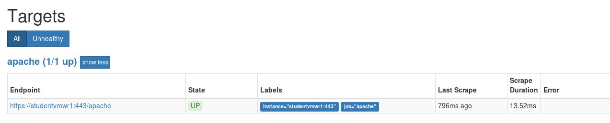
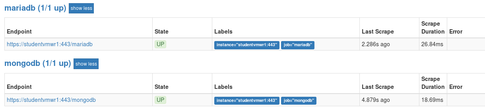
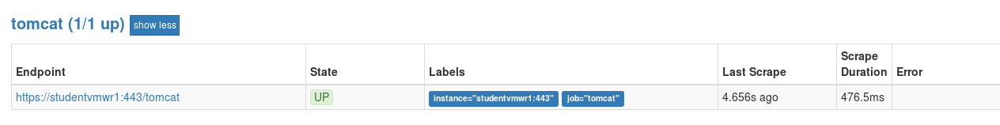
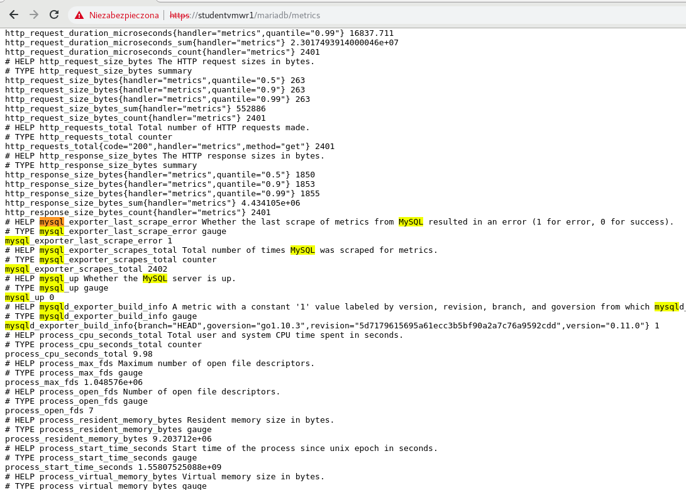
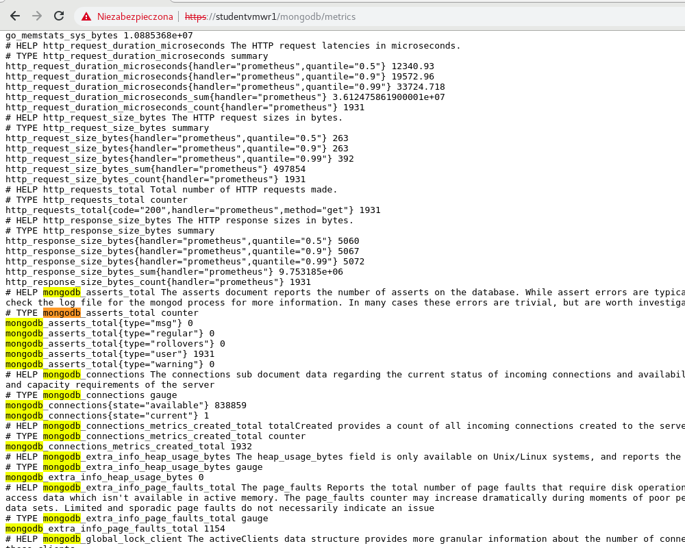
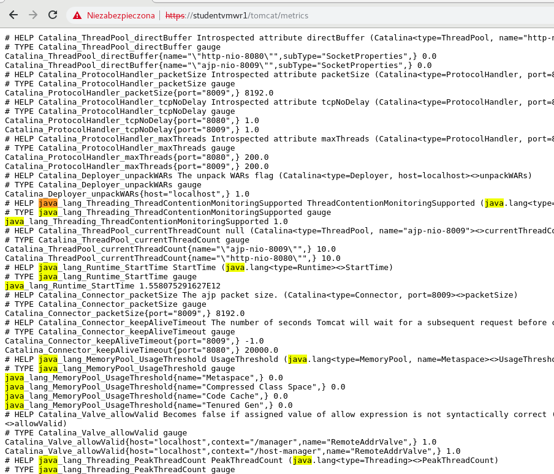

# Rozwiązanie zadań dodatkowych

## 13a. Udostępnij metryki serwera apache,tomcat,mariadb,mongodb pod następującymi adresemi:
<br/>
https://twój_serwer/metrics/mariadb
<br/>
https://twój_serwer/metrics/mongodb
<br/>
https://twój_serwer/metrics/apache
<br/>
https://twój_serwer/metrics/tomcat
<br/>

Cwiczenie ma na celu zbezpieczyć komunikacje pomiędzy serwerem prometheus a exporterami. Taka konfiguracja sprawdzi się gdy połączenie jest realizowane np pomiędzy 2 providerami chmury.

`Podpowiedź`
Jako serwera reverse proxy użyj nginxa. Do weryfikacji portów użyj poleciania:

```
docker ps -a --format '{{.Names}}"\t"{{.Ports}}' --filter="name=exp-*"
```

Aby dowiedzieć się na jakim porcie nasłuchuje dany exporter możesz użyć prometheus serwera:

http://twój_serwer:9090/targets

Wygląda znajomo?

W definicji połączenia - serwery petryk użyj dyrektywy upstream poznanej w poprzednim cwiczeniu.

### Rozwiązanie:
Output komendy - mapowanie portów:
```
exp-mariadb"	"0.0.0.0:9104->9104/tcp
exp-mongodb"	"0.0.0.0:9001->9001/tcp
exp-apache"	  "0.0.0.0:9117->9117/tcp
exp-tomcat"	  "0.0.0.0:9072->9072/tcp
...
```

w pliku /home/studentvm/lab/nginx/conf/ssl.conf dopisz następujące linie:

#### W sekcji definicji poprzednich upstreamów' od lini 10:

```
# MariaDB
upstream mariadb_exporter {
    server exp-mariadb:9104;
}

# MongoDB
upstream mongodb_exporter {
    server exp-mongodb:9001;
}

# Apache
upstream apache_exporter {
    server exp-apache:9117;
}

# MongoDB
upstream tomcat_exporter {
    server exp-tomcat:9072;
}
```
oraz

#### W sekcji server (Po definicji reguł dotyczących reverse proxy dla prometheus'a)

```
location /mariadb {
        proxy_pass              http://mariadb_exporter;
        proxy_set_header        Host $host;
        rewrite ^/mariadb/?$ /mariadb/metrics redirect;
        rewrite ^/mariadb/(.*)$ /$1 break;

    }
    location /mongodb {
        proxy_pass              http://mongodb_exporter;
        proxy_set_header        Host $host;
        rewrite ^/mongodb/?$ /mongodb/metrics redirect;
        rewrite ^/mongodb/(.*)$ /$1 break;

    }
    location /apache {
        proxy_pass              http://apache_exporter;
        proxy_set_header        Host $host;
        rewrite ^/apache/?$ /apache/metrics redirect;
        rewrite ^/apache/(.*)$ /$1 break;
    }
    location /tomcat {
        proxy_pass              http://tomcat_exporter;
        proxy_set_header        Host $host;
        rewrite ^/tomcat/?$ /tomcat/metrics redirect;
        rewrite ^/tomcat/(.*)$ /$1 break;
    }
```

Zrestartuj kontener vm-nginx:

```
docker restart vm-nginx
```

Aby zweryfikować czy konfiguracja działa poprawnie należy zweryfikować poszczególne strony:

https://twój_server/mongodb
https://twój_server/mariadb
https://twój_server/apache
https://twój_server/tomcat

Jeżeli z jakiegoś powodu strona z metrykami tomcata nie chce się otworzyć należy zrestartować kontener exp-tomcat.

```
docker restart exp-tomcat
```
Wyjaśnienie kontener exp-tomcat wymaga dość dużej liczby pamięci stąd wyświetlanie metryk może chwile zająć.

___


## 13b. Przekonfiguruj prometheus serwer tak by po kliknięciu na poszczególne "targety" odpowiednio:
```
mongodb
mariadb
tomcat
apache
```
zostały wyświetlone endpointy eksponujące metryki dla poszczególnych kontenerów. Przejscie ma być płynne i we wszystkich przypadkach szyfrowane za pomocą protokołu ssl.

### Rozwiązanie:
Cwiczenie to jest zależne od cwiczenia 11, oraz dodatkowego cwiczenia 13a. Bez poprawnego wykonania cwiczeń zależnych nie będziesz w stanie wykonać tego cwiczenia.

Z poziomu użytkownika studentvm na zdalnej maszynie laboratorium (SoftLayer) do pliku /home/studentvm/lab/prometheus/config/prometheus.yml dopisz następujące linie:

```
- job_name: mongodb
  scrape_interval: 5s
  metrics_path: /mongodb
  scheme: https
  tls_config:
      insecure_skip_verify: true
  static_configs:
    - targets: ['twój_server']

- job_name: mariadb
  scrape_interval: 5s
  metrics_path: /mariadb
  scheme: https
  tls_config:
      insecure_skip_verify: true
  static_configs:
    - targets: ['twój_serwer']

- job_name: apache
  scrape_interval: 5s
  metrics_path: /apache
  scheme: https
  tls_config:
      insecure_skip_verify: true
  static_configs:
    - targets: ['twój_serwer']

- job_name: tomcat
  scrape_interval: 5s
  metrics_path: /tomcat
  scheme: https
  tls_config:
      insecure_skip_verify: true
  static_configs:
    - targets: ['twój_server']
```

`Uwaga!`<br/>
Za twój_serwer podstaw rozwiązywalną nazwę z /etc/hosts. Możeszy użyć też adresu IP.


Aby konfiguracja działała należy wykonać jeszcze kilka procedur:

### Modyfikacja pliku /etc/hosts dla wszystkich kontenerów.
Z poziomu użytkownika studentvm do pliku *lab/studentvm/src/etc/hosts* dopisz następującą linię:

```
<twój adres IP maszyny w SoftLayer>   <nazwa twojej maszyny>.crc.ibm.lab <nazwa twojej maszyny>
```

np:

```
studentvm@docker02 lab]$ cat src/etc/hosts
# File copied via ansible automation
# Do not overwrite file because this is a part of CRC laboratory

127.0.0.1       localhost
10.200.200.1    docker-server
169.54.160.146  studentvmwr1.crc.ibm.lab	studentvmwr1 #<<< Moja zmiana

###                    ###
# Grafana CRC Laboratory #
###                    ###

# Main enclouser services
10.200.200.100  vm-grafana
10.200.200.101  vm-prometheus
.
..
...
10.200.200.157  exp-node
```

`Uwaga!`<br>
Za `nazwa twojej maszyny` oraz `twoj adres IP maszyny w SoftLayer` podstaw dane otrzymane przed rozpoczęciem laboratorium (informacja dostarczona przez instruktora).

Aby zmiany były widoczne dla serwera prometheus należy go zrestartować:

```
docker restart vm-prometheus vm-nginx
```

`Uwaga!`<br/>
Restartujemy również kontener vm-nginx ponieważ własnie na nim skonfigurowany jest mechanizm reverse proxy.


### Weryfikacja
Wykonujemy prostą weryfikacją mającą na celu zobrazować czy cwiczenie zostało wykonane prawidłowo.

Wchodzimy na stronę:

https://twój_serwer/prometheus

W zakładce Status → Targets





Klikamy na linki endpointów. Powinniśmy zostać przeniesieni bezpośrednio na serwer metryk:

#### apache:


#### mariadb:


`Tu widać, że cwiczenie 11 nie zostało poprawnie wykonane. Należy zweryfikować połączenie exportera do bazy danych MySQL! (docker logs exp-mariadb)`

#### mongodb:


#### tomcat:

