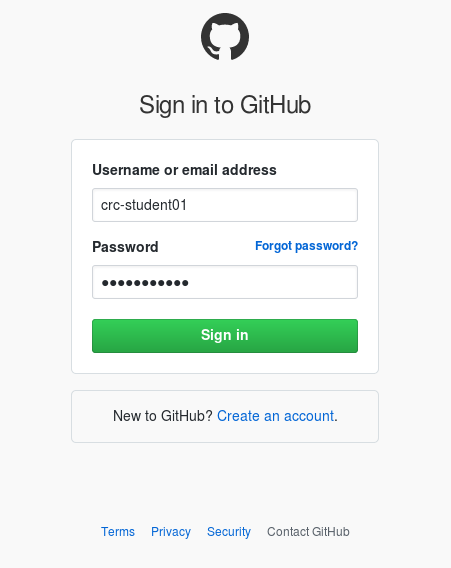
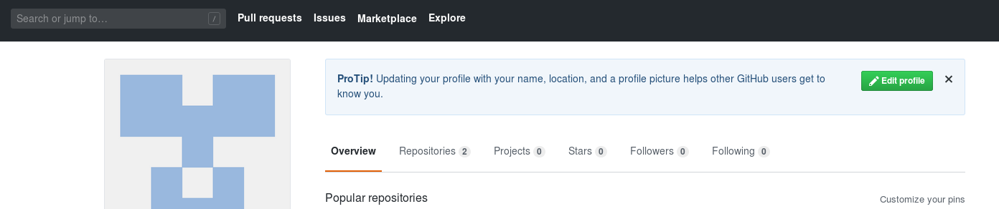
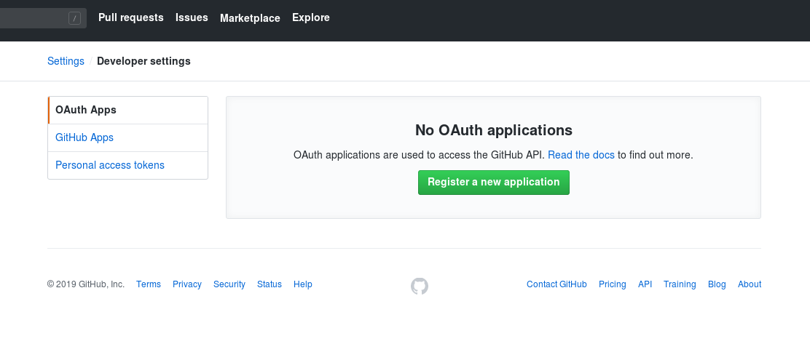
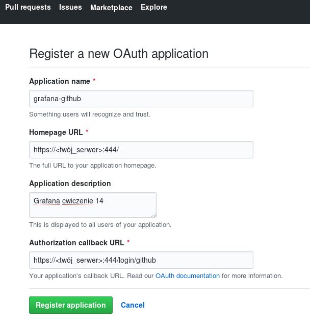
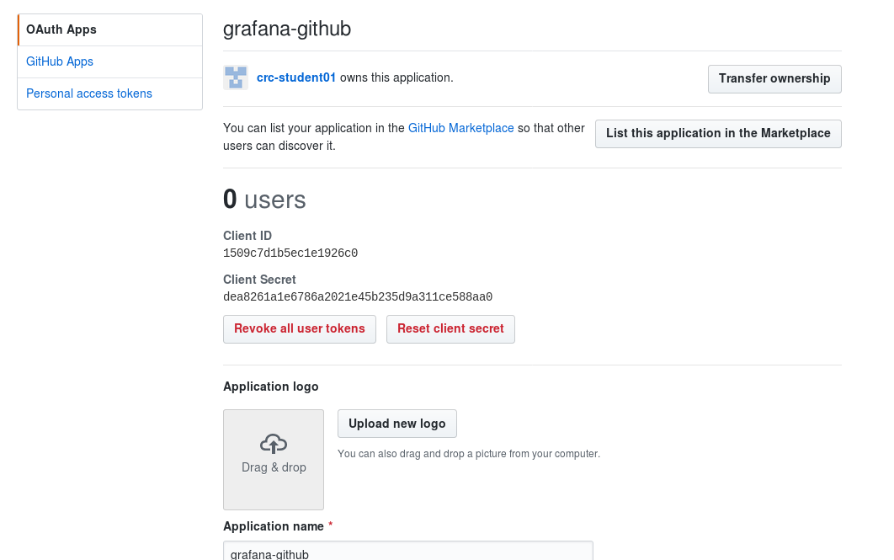
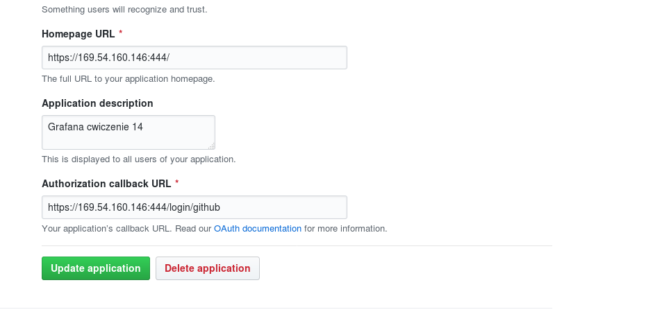
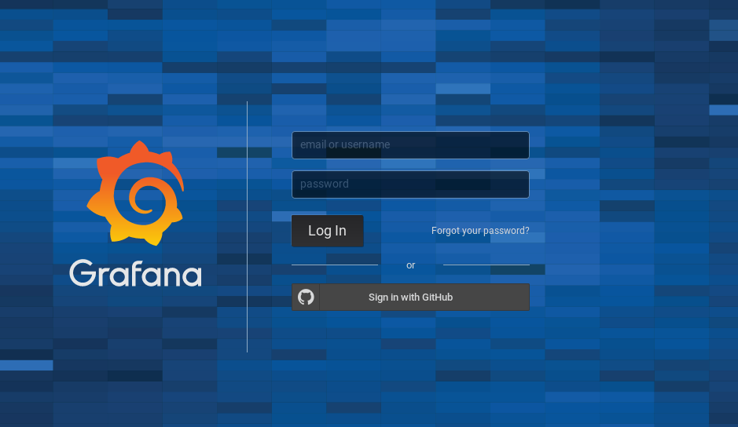
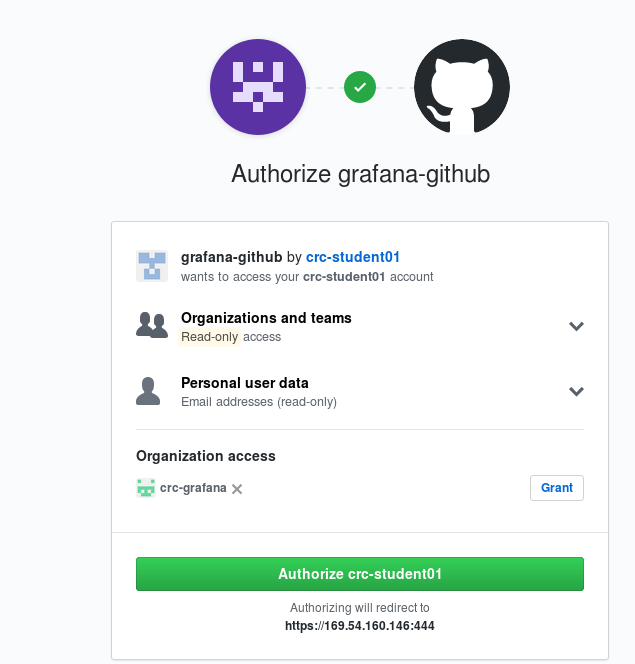
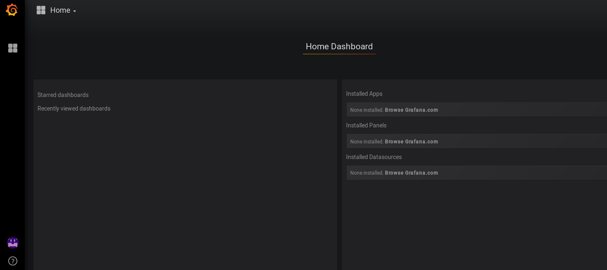
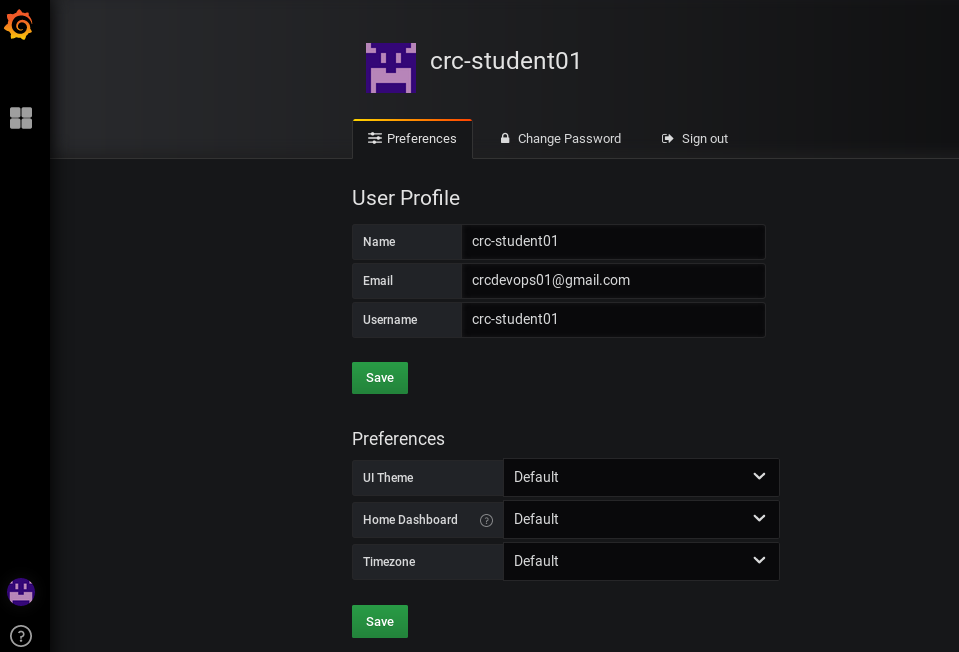

# Cwiczenie 14

## Cel
W tym ćwiczeniu nauczysz się kilka sztuczek związanych z administracją Grafaną. Skonfugurujemy autentykacje  do systemu z użyciem githuba oraz spróbujemy zmienić hasło użytkownika admin udając, że go nie znamy.

## Elemnty labotatorium - wymagania

Poniżej lista elementów wymaganych do wykonania cwiczenia.

+ Kontenery (muszą być uruchimione)
  * vm-grafana    port 3000

+ Konto na github dostarczone przez instruktora.


## Plan laboratorium
Cwiczenie zostało podzielone na 2 części:

1. Konfiguracja autentykacji z użyciem Github'a

2. Odzyskanie hasła użytkownika admin.

## Uruchomienie środowiska
Nie wymaga od uczestnika dodatkowych aktywności. Przed rozpoczęciem ćwiczenia sprawdź czy wymagane kontenery są uruchomione. `Jeżeli nie skontaktujcie się z instruktorem.`


### Konfiguracja autentykacji z użyciem Github'a
Cwiczenie wymaga konta na github. Należy wykorzystać konto otrzymane podczas wcześniejszych laboratoriów.
Użyjemy go do utworzenia tzw. Oauth Apps.

Logujemy się do githuba:

https://github.com



użytkownik: crc-student<nr> (01-20)
hasło:      crc2019PWR#

Kolejno wejdź w konfiguracje profilu → *User profile*



Następnie *Edit profile* → *Developer settings*



Wypełnij wartości zgodnie z poniższym zrzutem ekranu. ! Pamiętaj za *<twój_serwer>* należy
podstawić adres IP twojego serwera. Bardzo ważne jest żeby był to własnie adres IP ponieważ podana
strona musi być osiągalna z githuba dostępnego w Internecie!



Klikamy przycisk Register.

Brawo udało nam się zarejestrować nową aplikację:



Na maszynie SoftLayer z poziomu użytkownika studentvm w pliku /home/studentvm/lab/grafana/conf/grafana.ini

Odszukaj sekcję dotyczącą autentykacji z poziomu githuba i aktywuj ją zgodnie z poniższymi wytycznymi:

```
#################################### Github Auth ##########################
[auth.github]
enabled = true
allow_sign_up = true
client_id = <Client Id - patrz zarejestrowane aplikacje github>
client_secret = <Client Secret - patrz zarejestrowane aplikacje github>
scopes = user:email,read:org
auth_url = https://github.com/login/oauth/authorize
token_url = https://github.com/login/oauth/access_token
api_url = https://api.github.com/user
;team_ids =
;allowed_organizations =
```

Odszukaj frazę root_url i zmien zgodnie z wytyczną:
```
root_url = https://<twój_serwer>:444/
```

`Uwaga!`<br/>
Za wartość twój_serwer podstaw IP serwera w SoftLayer!

Zrestartuj kontener vm-grafana
```
docker restart vm-grafana
```

Spróbuj zalogować się do grafan używając konta github:



Podczas pierwszego logowania github zapyta Cię o autoryzację aplikacji dla użytkownika crc-student<01-20>. Należy kliknąć Authorize. Zaraz po tym zostaniesz przeniesieony na stronę grafany.







Uprawnienia w grafanie nie pozwalają na prace administracyjne, użytkownik z github'a nie posiada wystarczających uprawnień. W ramach cwiczenia dodatkowego skonfiguruj system tak by użytkownik crc-student-<01-20> był w stanie zarządzać Grafaną tak jak użytkownik admin.

### Odzyskanie hasła dla admin:
Pdłączamy się do kontenera vm-grafana z poziomu użytkownika root!
```
$ docker exec -it --user=root vm-grafana bash
root@4614f20797be:/usr/share/grafana# id
uid=0(root) gid=0(root) groups=0(root)
```

Domyślnie grafana używa bazy plikowej, którą można przeglądać używając narzędzi sqllite3. Będziemy potrzebować pakiety sqllite3. Spróbujmy go zainstalować

Aktualizujemy listę pakietów:
```
root@4614f20797be:/usr/share/grafana# apt-get update
Get:1 http://security-cdn.debian.org/debian-security stretch/updates InRelease [94.3 kB]
Ign:2 http://cdn-fastly.deb.debian.org/debian stretch InRelease    
Get:3 http://cdn-fastly.deb.debian.org/debian stretch-updates InRelease [91.0 kB]
Hit:4 http://cdn-fastly.deb.debian.org/debian stretch Release                        
Fetched 185 kB in 2s (73.8 kB/s)
Reading package lists... Done
```

Instalujemy sqllite3:
```
root@4614f20797be:/usr/share/grafana# apt-get -y install sqlite3
Reading package lists... Done
Building dependency tree       
Reading state information... Done
The following additional packages will be installed:
  libreadline7 libsqlite3-0 readline-common
Suggested packages:
  readline-doc sqlite3-doc
The following NEW packages will be installed:
  libreadline7 libsqlite3-0 readline-common sqlite3
0 upgraded, 4 newly installed, 0 to remove and 16 not upgraded.
Need to get 1577 kB of archives.
After this operation, 4062 kB of additional disk space will be used.
Do you want to continue? [Y/n] y
Get:1 http://cdn-fastly.deb.debian.org/debian stretch/main amd64 readline-common all 7.0-3 [70.4 kB]
Get:2 http://cdn-fastly.deb.debian.org/debian stretch/main amd64 libreadline7 amd64 7.0-3 [151 kB]
Get:3 http://cdn-fastly.deb.debian.org/debian stretch/main amd64 libsqlite3-0 amd64 3.16.2-5+deb9u1 [572 kB]
Get:4 http://cdn-fastly.deb.debian.org/debian stretch/main amd64 sqlite3 amd64 3.16.2-5+deb9u1 [784 kB]
Fetched 1577 kB in 0s (5773 kB/s)     
debconf: delaying package configuration, since apt-utils is not installed
Selecting previously unselected package readline-common.
(Reading database ... 7097 files and directories currently installed.)
Preparing to unpack .../readline-common_7.0-3_all.deb ...
Unpacking readline-common (7.0-3) ...
Selecting previously unselected package libreadline7:amd64.
Preparing to unpack .../libreadline7_7.0-3_amd64.deb ...
Unpacking libreadline7:amd64 (7.0-3) ...
Selecting previously unselected package libsqlite3-0:amd64.
Preparing to unpack .../libsqlite3-0_3.16.2-5+deb9u1_amd64.deb ...
Unpacking libsqlite3-0:amd64 (3.16.2-5+deb9u1) ...
Selecting previously unselected package sqlite3.
Preparing to unpack .../sqlite3_3.16.2-5+deb9u1_amd64.deb ...
Unpacking sqlite3 (3.16.2-5+deb9u1) ...
Setting up readline-common (7.0-3) ...
Setting up libreadline7:amd64 (7.0-3) ...
Processing triggers for libc-bin (2.24-11+deb9u3) ...
Setting up libsqlite3-0:amd64 (3.16.2-5+deb9u1) ...
Setting up sqlite3 (3.16.2-5+deb9u1) ...
Processing triggers for libc-bin (2.24-11+deb9u3) ...
root@4614f20797be:/usr/share/grafana#
```

Aby uniknąć problemów związanych z uprawnieniami do pliku bazy przęłączmy się na użytkownika grafana:
```
root@4614f20797be:/usr/share/grafana# su - grafana
No directory, logging in with HOME=/
$ pwd
/
$ ls -la /var/lib/grafana/grafana.db
-rw-r--r--. 1 grafana grafana 409600 May 17 08:53 /var/lib/grafana/grafana.db
$ bash     	
```
Uruchamiamy sqllite3:
```
grafana@4614f20797be:/$ sqlite3 /var/lib/grafana/grafana.db
SQLite version 3.16.2 2017-01-06 16:32:41
Enter ".help" for usage hints.
```

Zmieniamy hasło użytkownika na admin! Tak ten ciąg to zaszyfrowane hasło "admin"

```
sqlite> update user set password = '59acf18b94d7eb0694c61e60ce44c110c7a683ac6a8f09580d626f90f4a242000746579358d77dd9e570e83fa24faa88a8a6', salt = 'F3FAxVm33R' where login = 'admin';
sqlite> .exit
```

Spróbuj zalogować się na użytkownika admin używając hasła "admin".

https://twój_serwer:444/

Gdzie *twój_serwer* to adres maszyny w SoftLayer.

Istnieje jeszcze kilka innych alternatywnych metod. Przyjżyjmy się natywnej. W tym celu wykorzystamy narzędzie grafana-cli.

Z racji iż narzędzie grafana-cli dostępne jest tylko z poziomu użytkownika root wpisujemy 2 x exit:

```
grafana@4614f20797be:/$ exit
exit
$ exit
```
Sprawdzamy czy jesteśmy użytkownikiem root:
```
root@4614f20797be:/usr/share/grafana# id
uid=0(root) gid=0(root) groups=0(root)
```

Uruchamiamy narzędzie:
```
root@4614f20797be:/usr/share/grafana# grafana-cli admin reset-admin-password --homepath "/usr/share/grafana" crc2019
INFO[05-17|14:11:55] Connecting to DB                         logger=sqlstore dbtype=sqlite3
INFO[05-17|14:11:55] Starting DB migration                    logger=migrator

Admin password changed successfully ✔
```

Ustaliliśmy nowe hasło: crc2019
Należy jeszcze zweryfikować czy hasło działa i czy jesteśmy w stanie zalogować się do grafany z użyciem interfejsu WebGui. Uwaga hasło musi spełniać pewne wymogi inaczej komenda powyższa zakończy się niepowodzeniem:

```
root@4614f20797be:/usr/share/grafana# grafana-cli admin reset-admin-password --homepath "/usr/share/grafana" ibm     
INFO[05-17|14:15:15] Connecting to DB                         logger=sqlstore dbtype=sqlite3
INFO[05-17|14:15:15] Starting DB migration                    logger=migrator

Error: New password is too short

NAME:
   Grafana cli admin reset-admin-password - reset-admin-password <new password>

USAGE:
   Grafana cli admin reset-admin-password [command options] [arguments...]

OPTIONS:
   --homepath value  path to grafana install/home path, defaults to working directory
   --config value    path to config file
```
