# Ćwiczenie 2

## Cel

Celem ćwiczeń jest pokazanie w jaki sposób zarządzać użytkownikami. W tej części dowiesz się jak stworzyć nowego użytkownika i dodać go do organizacji Omówimy również poziomy dostępów do poszczególnych elementów systemu.

## Elemnty labotatorium

Tu znajdziecie ogólny zarys wymagań oraz elementów ćwiczenia:

+ Kontenery
  * vm-grafana

## Weryfikacja kontenerów oraz poszczególnych elementów laboratorium:

Po zalogowaniu na serwer z poziomu użytkownika studentvm wpisujemy:
```
docker ps | egrep "vm-grafana"
5d4afa777fdf        crcdevops/grafana:latest       "/run.sh"                23 hours ago        Up 22 hours         3001/tcp, 0.0.0.0:3001->3000/tcp   vm-grafana

```

*Jeżeli kontenery nie wystartowały lub powyższa komenda nie zwróciła żadnych wyników proszę zwrócić się do instruktora o pomoc*


Wylistuj zawartość katalogu: /home/studentvm/lab/cwiczenia/2

```
drwxrwxr-x. 3 studentvm studentvm 4096 Mar  5 15:00 .
drwxrwxr-x. 4 studentvm studentvm 4096 Mar  5 15:00 ..
-rw-rw-r--. 1 studentvm studentvm 2388 Mar  5 14:59 cwiczenie2.md
drwxrwxr-x. 2 studentvm studentvm 4096 Mar  5 15:00 src
-rwxrwxrwx. 1 studentvm studentvm  427 Feb 26 10:58 wykonaj.sh

```

Jeżeli zawartość jest zgodna można przejść do dalszej części ćwiczenia.

## Tworzenie użytkowników
Tworzymy uzytkowników zgodnie z tabelą:

tabela 1

| Nr | Login         | Hasło   | Mail                        | Uprawnienia | Organizacja |
|----|---------------|---------|-----------------------------|-------------| ------------|
| 1  | administrator | crc2019 | administrator@devops.crc    | Admin       | Grupa2      |
| 2  | gosc          | crc2019 | gosc@devops.crc             | Viever      | Grupa2      |


Postępuj zgodnie z poniższą instrukcją:

W oknie przeglądarki wpisz następujący adres url:

http://grafana:3000

Logujemy się z użyciem następujących danych:


| Login | Hasło   |
|-------|:-------:|
| admin | crc2019 |


"Menu" → "Server Admin"<br/>

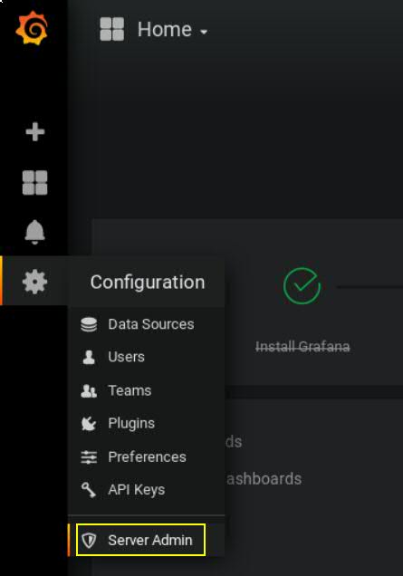

"Users" → "Add new user"<br/>
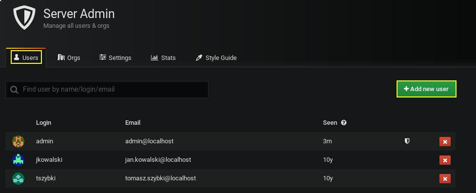

Wypełniamy pola (patrz tabela 1)<br/>
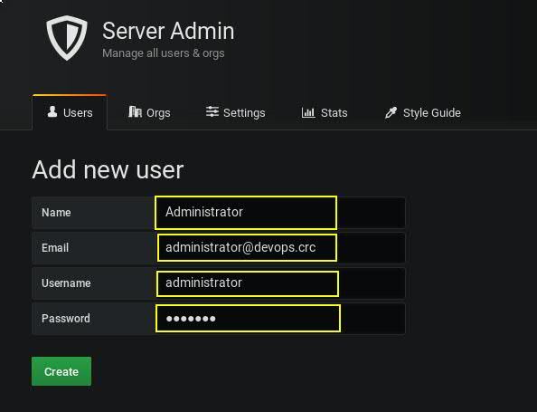

Klikamy "Create"<br/>
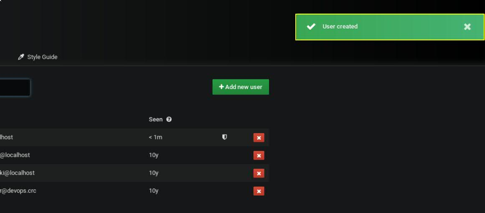

Powtarzamy tą samą operacje dla użytkownika "gosc"<br/>
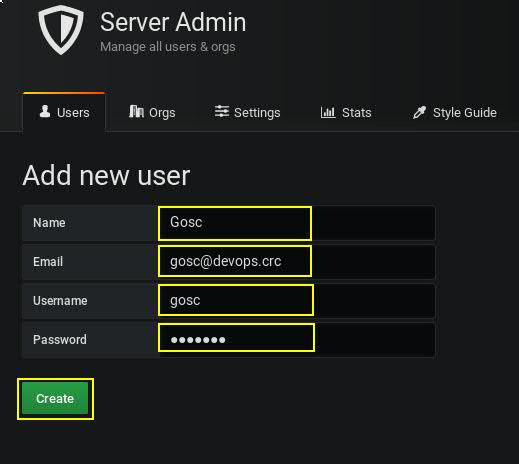

Aby zobaczyć rezultaty naszej operacji klikamy zakładkę "Users".

Kolejny etap to utworzenie organizacji oraz zapisanie do nich użytkowników. Przechodzimy do utworzenia organizacji o nazwie "Grupa2". W menu "Server Admin" klikamy: "Orgs" i kolejno "+New Org"
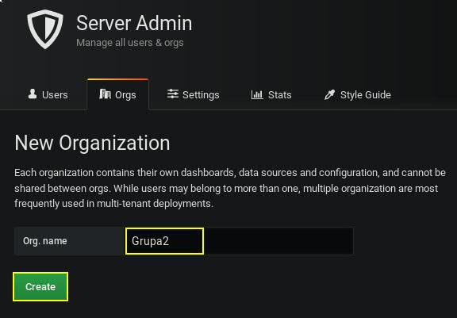

`Pola wypełniamy zgodnie z zalożeniami ćwiczenia (patrz tabela 1)`

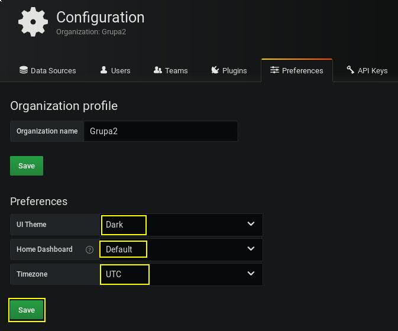

Klikamy "Save"<br/>
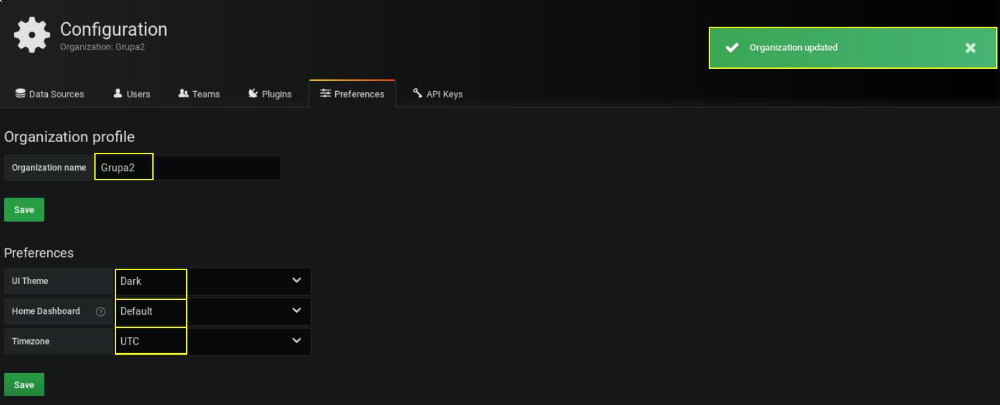

Kolejny etap to dodanie uzytkowników do organizacji o nazwie "Grupa2". W tym celu w menu "Server Admin" przechodzimy na zakładkę "Users", kolejno klikamy użytkownika "administrator". Powinno pojawić się okno edycji użytkownika.<br/>
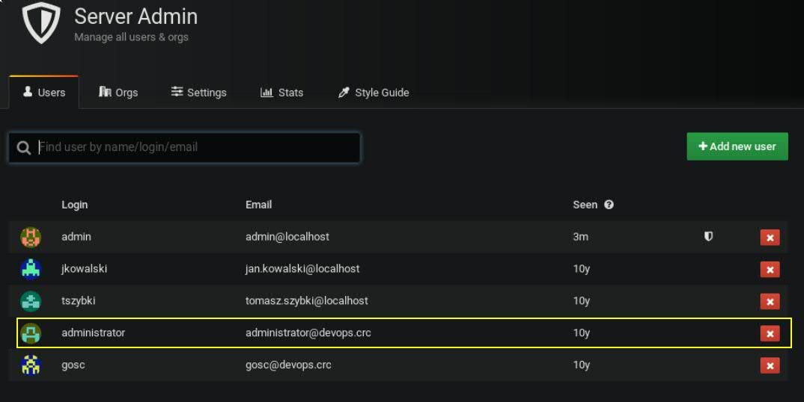

Zgodnie z zaleceniami dodajemy użytkownika do organizacji "Grupa2" z uprawnieniami "Admin"<br/>
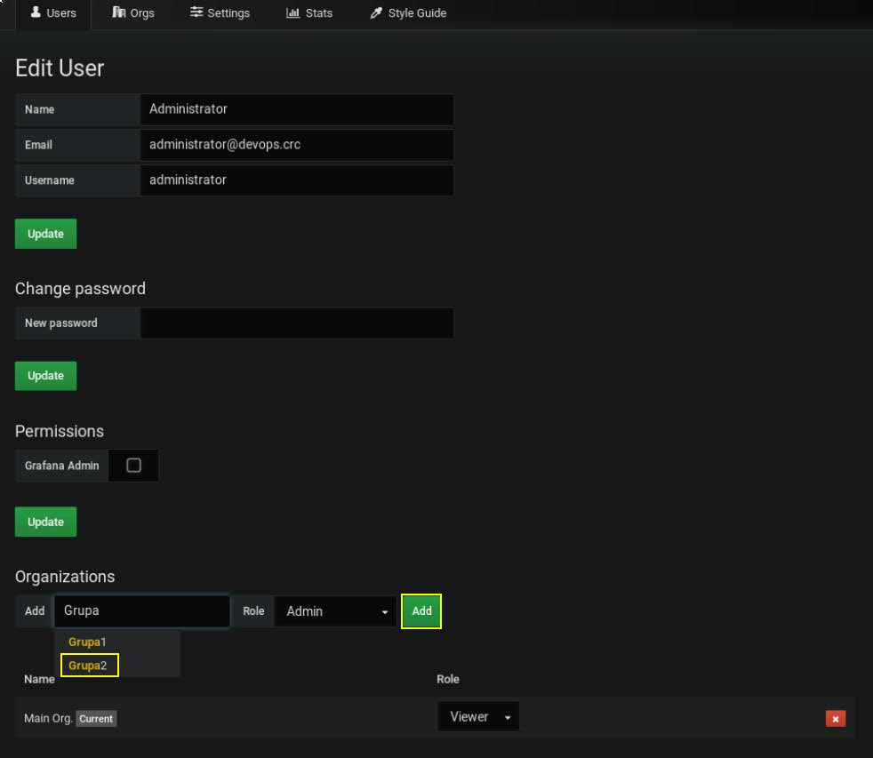

Klikamy "Add"
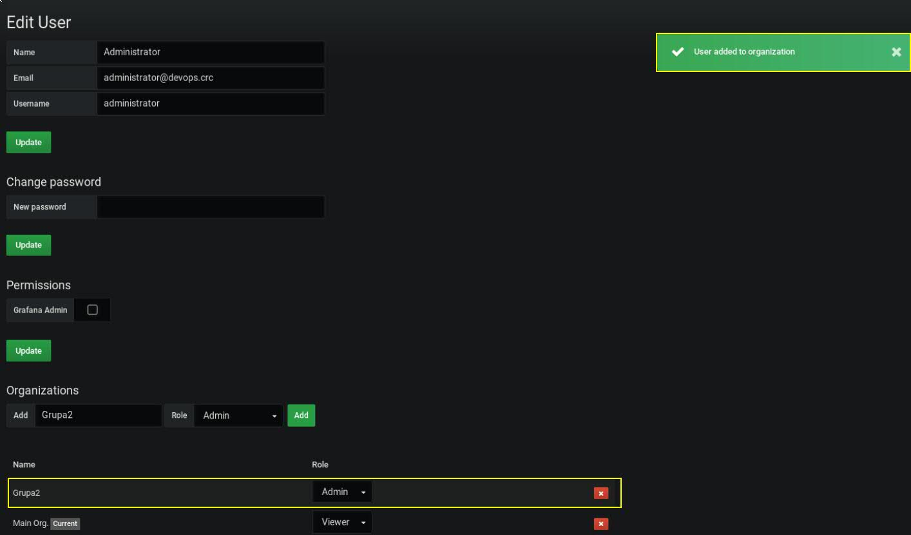

W obu przypadkach usuwamy użytkowników z grupy "Main Org.". Jest to domyślna grupa ustawiana w momencie tworzenia użytkownika. W kwestii wyjaśnienia system nie pozwala utworzyć użytkownika bez przypisywania go do jakiejkolwiek grupy.

Jak widzimy użytkownik został dodany do organizacji "Grupa2". Operacje tą należy powtórzyć dla użytkownika gosc ale pamiętajmy o odpowiedniej roli (patrz tablela 1)

Brawo! Udało się Wam utworzyc 2 użytkowników i zapisać ich do organizacji "Grupa2". W ramach ćwiczenia zachęcam Was do zalogowania się za pomocą kont gosc oraz administrator i zweryfikowania uprawnienień

### Jeżeli z jakiegoś powodu nie byłeś w stanie wykonać tego ćwiczenia użyj skryptu.
```
~./cwiczenia/2/wykonaj.sh admin crc2019
```

Uwaga!
Wykonując powyższy skrypt należy pamiętać o 2 parametrach. Z racji, iż w pierwszym ćwiczeniu zmieniliśmy hasło użytkownika "admin" skrypt wymagał parametryzacji.


[](../../cwiczenia/1/cwiczenie1.md)
[](../../cwiczenia/3/cwiczenie3.md)
