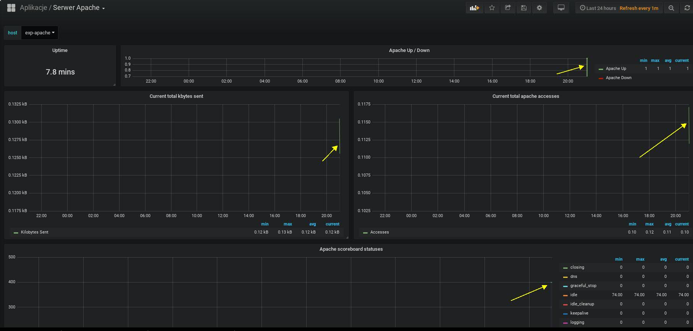

# Cwiczenie 3

## Cel
Poznanie mechanizmów importu oraz eksportu dashboardów w formacie json.
Dodawanie wykresów do katalogów odpowiadających tematyce grafów.

## Wprowadzenie
Nie da się ukryć, że Grafana jest nowoczesnym systemem do tworzenia dashboardów. Wcale nie musi być wykorzystywana tylko do
monitorowania procesów biznesowych. Ma bardzo duże zastosowanie. Można ją wykorzystać np. do wizualizacji
amplitudy temperatur rocznych. Jest w stanie wizualizować każdy typ danych pochodzący z dowolnego systemu. To sprawia, że jest
bardzo elastyczna i konkurencyjna w stosunku do innych produktów. Jak większość systemów pozwala wykorzystywać wzorce.
Konfiguracja poszczególnych grafów/dashboardów może zostać zapisana w notacji JSON (JavaScript Object Notation) a następnie eksportowana oraz importowana przez innych użytkowników grafany.   Całą listę gotowych do importu dashboardów znajdziecie tutaj:

https://grafana.com/dashboards


Jest to bardzo ciekawe miejsce pozwalające na publikacje najciekawszych konfiguracji. W prosty sposób
pobieramy oraz importujemy dashboardy dla naszego systemu. Przy każdym dashboardzie podana jest ilość pobrań. Pozwala to na wstępne oszacowanie popularność danego rozwiązania. Wyszukiwarka dostępna na stronie pozwala kategoryzować dashboardy na podstawie:
źródła danych, typu panelu, systemu, kolektora. Działa bardzo sprawnie i w prosty sposób znajdziemy to czego szukamy. Jeżeli uznamy, że stworzyliśmy ciekawy system wizualizacji możemy się nim podzielić z innymi.


## Elemnty labotatorium

Tu znajdziecie ogólny zarys wymagań oraz elementów ćwiczenia:

+ Kontenery
  * vm-grafana
  * vm-prometheus
  * vm-influxdb
  * vm1-os (node exporter)
  * vm2-os (nede exporter)
  * vm-tomcat
  * exp-tomcat
  * vm-apache
  * exp-apache


+ Pliki dashboardów (format json)
  * cwiczenia/3/wczytaj/apache_rev5.json
  * cwiczenia/3/wczytaj/JMX-Overview.json
  * cwiczenia/3/wczytaj/mysql-overview_rev10.json
  * cwiczenia/3/wczytaj/mysql_rev1.json
  * cwiczenia/3/wczytaj/mongodb_rev2.json
  * cwiczenia/3/wczytaj/node-exporter-full_rev13.json


## Weryfikacja kontenerów oraz poszczególnych elementów laboratorium:

Po zalogowaniu na serwer z dockerem z poziomu użytkownika studentvm wpisujemy:
```
docker ps -a | egrep "vm-grafana|vm-prometheus|vm-influxdb|vm1-os|vm2-os|vm-tomcat|vm-apache|exp-apache|exp-tomcat"
```

*Jeżeli kontenery nie wystartowały lub nie są uruchomione poproś o pomoc instruktora*

Wylistuj zawartość katalogu: cwiczenia/3
```
total 28
drwxrwxr-x.  4 studentvm studentvm 4096 Mar 11 21:30 .
drwxrwxr-x. 13 studentvm studentvm 4096 Mar 10 16:46 ..
-rw-rw-r--.  1 studentvm studentvm 4794 Mar 14 08:03 cwiczenie3.md
drwxrwxr-x.  2 studentvm studentvm 4096 Mar 11 21:08 src
drwxrwxr-x.  2 studentvm studentvm 4096 Mar 11 21:25 wczytaj
-rwxr-xr-x.  1 studentvm studentvm  163 Mar 11 22:08 wykonaj.sh

```

W katalogu wczytaj powinny znajdować się następujące plik z rozszerzeniem json:

```
total 848
drwxrwxr-x. 2 studentvm studentvm   4096 Mar 11 21:25 .
drwxrwxr-x. 4 studentvm studentvm   4096 Mar 11 21:30 ..
-rw-rw-r--. 1 studentvm studentvm  18327 Mar 11 19:23 apache_rev5.json
-rw-rw-r--. 1 studentvm studentvm  50005 Mar 11 19:23 JMX-Overview.json
-rw-rw-r--. 1 studentvm studentvm  41882 Mar 11 21:25 mongodb_rev2.json
-rw-rw-r--. 1 studentvm studentvm 103483 Mar 11 19:24 mysql-overview_rev10.json
-rw-rw-r--. 1 studentvm studentvm  24670 Mar 11 19:23 mysql_rev1.json
-rw-rw-r--. 1 studentvm studentvm 602887 Mar 11 19:23 node-exporter-full_rev13.json

```

Jeżeli zawartość jest zgodna można przejść do cześci praktycznej ćwiczenia.

tabela 1:

| plik json                           | katalog     |
|-------------------------------------|-------------|
| apache_rev5.json                    | Aplikacje   |
| JMX-Overview.json                   | Aplikacje   |
| mysql-overview_rev10.json           | Bazy-Danych |
| mysql_rev1.json                     | Bazy-Danych |
| mongodb_rev2.json                   | Bazy-Danych |
| node-exporter-full_rev13.json       | Systemy     |

## Logujemy się do Grafany

http://grafana:3000

logujemy się do systemu za pomocą następujących danych:

admin
crc2019

Następnie po lewej stronie znajduje się menu główne Grafany, klikamy przycisk "+"

Wybieramy "Folder":<br/>


Tworzymy 3 foldery o nazwach: Aplikacje, Bazy-Danych oraz Systemy:<br/>


Po kliknięciu "Dashboards" jak na poniższym zrzucie ekranu, zostaniemy przekierowani do główneg drzewa systemu:<br/>


Tworzymy kolejny folder Bazy-Danych<br/>


Gdy klikniemy i zatwierdzimy tworzenie folderu u samej góry wyskoczy zielony popup:<br/>


Operacje tą należy powtórzyc dla ostatniego folderu a mianowicie "Systemy"

Mając już foldery przejdziemy do zagadnienia jakim jest import dashboardów. Poniżej znajdziecie instrukcje w jaki sposób można importować definicje dashboardów za pomocą interfejsu graficznego:

Z menu po lewej stronie wybieramy tak jak miało to miejsce w przypadku folderów "+" kolejno "Import":<br/>


Klikamy "Upload .json File":<br/>


Wybieramy folder dla grafu oraz źródło danych:<br/>


Uwaga!<br/>
`W przypadku grafów zawierających definicję źródła danych nie będzie potrzebny jej wybór.`

Źrodła poszczególnych plików konfiguracyjnych oraz informacje o przynależności do danego folderu znajdziecie w tabeli 1

Po kliknięciu przycisku "Import" powinniśmy zostać przeniesieni na ekran swieżo
zaimportowaneg dashboardu:<br/>



W ramach cwiczenia zapoznania się z interfejsem możemy zmienić zakres ostatnio wyswietlanych danych: wybieramy ostatnie 5 minut.<br/>


Operację tą powtarzamy dla pozostałych dashboardów zamieszczając je w odpowiednich folderach patrz tabela 1.

### Jeżeli z jakiegoś powodu nie byłeś w stanie wykonać tego cwiczenia wykonaj następujący skrypt

z poziomu katalogu domowego zklonowanego repozytorium
```
cd cwiczenia/3
./wykonaj.sh
```


[](../../cwiczenia/2/cwiczenie2.md)
[](../../cwiczenia/4/cwiczenie4.md)
