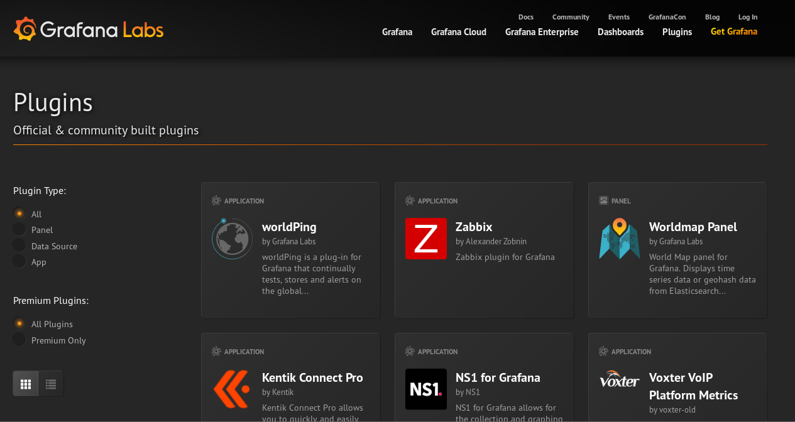
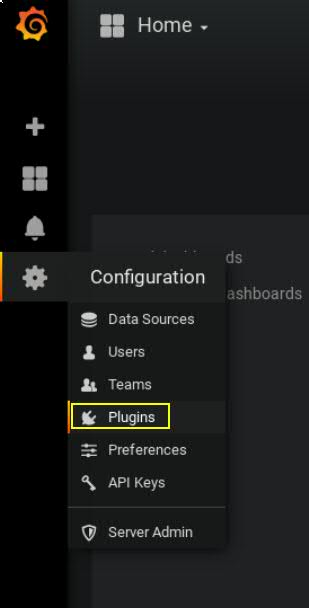
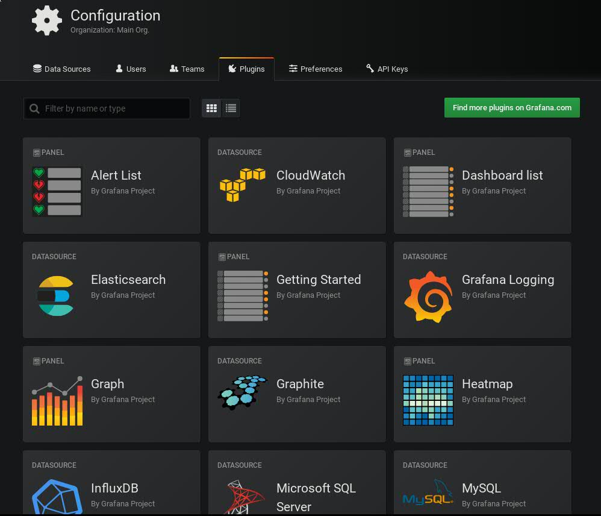
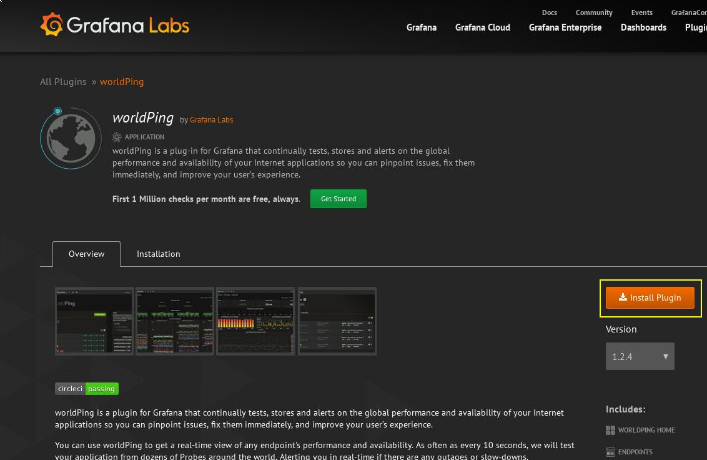
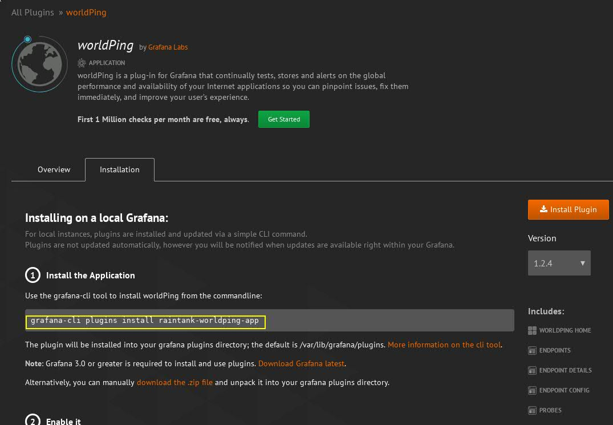

# Cwiczenie 4

## Cel
Rozszerzenie funkcjonalności systemu grafana

## Wprowadzenie
Funkcjonalność grafany można rozszerzać poprzez instalację pluginów.
Tak jak w przypadku templatów pluginy można znaleźć i pobrać z następującej strony https://grafana.com/plugins




Obecnie można rozróżnić 2 rodzaje pluginów: komercyjne zwane inaczej premium oraz darmowe. W przypadku premium są to mechanizmy umożliwiające grafanie na dostęp do komercyjnych źródeł danych takich jak np New Relic, Datadog, Dynatrace i wiele innych.


## Elemnty labotatorium

Tu znajdziecie ogólny zarys wymagań oraz elementów ćwiczenia:

+ Kontenery
  * vm-grafana


## Weryfikacja kontenerów oraz poszczególnych elementów laboratorium:

Po zalogowaniu na serwer z dockerem z poziomu użytkownika "studentvm" wpisujemy:
```
docker ps -a | egrep "vm-grafana"
```

*Jeżeli kontener nie wystartował lub nie jest uruchomiony poproś o pomoc instruktora*

Wylistuj zawartość katalogu: *cwiczenia/4*

```
$ ls -la
razem 12
drwxrwxr-x 3 studentvm studentvm   56 03-18 11:16 .
drwxrwxr-x 9 studentvm studentvm   71 03-18 07:37 ..
-rw-rw-r-- 1 studentvm studentvm 4755 03-18 11:00 cwiczenie4.md
drwxrwxr-x 2 studentvm studentvm   25 03-18 07:46 src
-rw-rw-r-- 1 studentvm studentvm  166 03-18 11:16 wykonaj.sh

```


Jeżeli zawartość jest zgodna można przejść do dalszej części ćwiczenia.


## Logujemy się do Grafany

http://grafana:3000

Do logowania używamy następujących danych:

login: admin
hasło: crc2019

## Weryfikacja zainstalowanych pluginów
Pierwszą czynnością jaką wykonamy to zapoznamy się z listą pluginów dostarczonych z instalacją systemu.

W menu grafany klikamy "Plugins"<br/>


Jak widać na załączonym zdjęciu już po instalacji grafany mamy sporą listę pluginów do dyspozycji.<br/>


Wyszukując interesujący nas plugin na oficjalnej stronie grafany dostarczana nam jest pełna informacja na temat jego funkcjonalności oraz przeznaczenia. Po kliknięciu przycisku *Install Plugin* pojawi się instrukcja w jaki sposób zainstalować i wdrożyć rozwiązanie.



Używamy komendy *grafana-cli*<br/>


Jak można słusznie zauważyć instalację pluginów przeprowadza się z poziomu konsoli. Tak więc aby zainstalować plugin, potrzebujemy aktywnego dostępu do konsoli systemu z grafaną. W naszym przypadku to kontener vm-grafana. W związku z tym musimy podłączyć się do kontenera wykonując poniższą komendę:

```
$ docker exec -it --user grafana vm-grafana bash
grafana@97f0cb4836fd:/usr/share/grafana$
```

Instalujemy WorldPing (bardzo ciekawy plugin umożliwiający monitorowanie web serwisów z różnych miejsc na Ziemi)

```
grafana@97f0cb4836fd:/usr/share/grafana$ grafana-cli plugins install raintank-worldping-app
installing raintank-worldping-app @ 1.2.4
from url: https://grafana.com/api/plugins/raintank-worldping-app/versions/1.2.4/download
into: /var/lib/grafana/plugins

✔ Installed raintank-worldping-app successfully

Restart grafana after installing plugins . <service grafana-server restart>
```

Aby zmiany były widoczne i grafana wiedziała o tym, że w jej zbiorze pojawiła się nowa funkcjonalność wymagany jest restart. W związku z tym należy opuścic aktywną sesje, wpisujemy:

```
grafana@97f0cb4836fd:/usr/share/grafana$ exit
exit
$
```

Następnie zrestartować kontener vm-grafana:

```
$ docker restart vm-grafana
vm-grafana
$
```

Weryfikujemy czy plugin został zainstalowany i nie ma żadnych problemów:

```
$ docker exec -it --user grafana vm-grafana bash -c 'grafana-cli plugins ls'
installed plugins:
raintank-worldping-app @ 1.2.4

Restart grafana after installing plugins . <service grafana-server restart>

$
```

`Powyższe polecenie wyświetla listę zainstalowanych pluginów bez konieczności otwierania aktywnej sesji docker do kontenera z grafaną.`

Weryfikacji można również dokonać używając do tego przeglądarki (patrz Weryfikacja zainstalowanych pluginów)

### Jeżeli z jakiegoś powodu nie byłeś w stanie wykonać tego cwiczenia wykonaj następujący skrypt

z poziomu katalogu domowego zklonowanego repozytorium
```
cd cwiczenia/4
./wykonaj.sh
```

[](../../cwiczenia/3/cwiczenie3.md)
[](../../cwiczenia/5/cwiczenie5.md)
