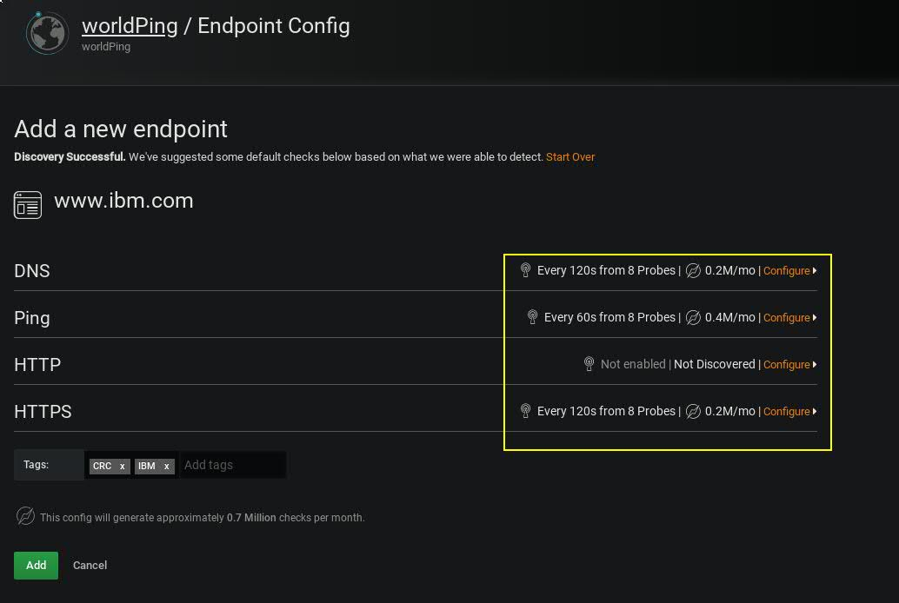
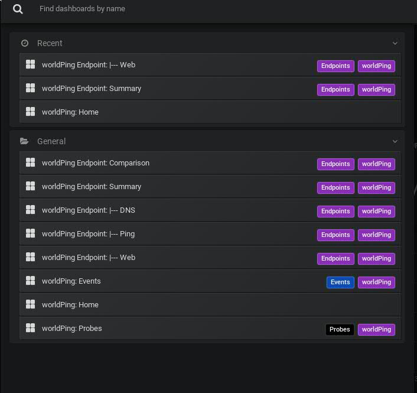

# Cwiczenie 5

## Cel
W ćwiczeniu zajmiemy się konfiguracją plugina WorldPing. Jest to narzędzie, które idealnie nadaje się do monitorowania dostępności webserwisów oraz stron z zewnątrz. Istniej możliwość skonfigurowania próbników na różnych kontynentach! Pozwala na bardzo dokładny monitoring dostępności web serwisów.


## Elemnty labotatorium

Tu znajdziecie ogólny zarys wymagań oraz elementów ćwiczenia:

+ Kontenery
  * vm-grafana


## Weryfikacja kontenerów oraz poszczególnych elementów laboratorium:

Po zalogowaniu na serwer z dockerem z poziomu użytkownika "studentvm" wpisujemy:
```
docker ps -a | egrep "vm-grafana"
```

*Jeżeli kontener nie wystartował lub nie jest uruchomiony poproś o pomoc instruktora*

## Logujemy się do Grafany (SoftLayer)

http://grafana:3000

Uwaga!

Do logowania używamy następujących danych:

login: admin
hasło: crc2019

## Logujemy się do Grafany (Grafana cloud - https://grafana.com/)
Czemu tak? Będziemy potrzebować klucza aby móc aktywować WorldPing w naszym systemie. Część Plaginów wymaga aktywacji konta w Grafana Cloud. Jest to zwiazane głównie z pluginami premium.

Po zalogowaniu klikamy "Personal" następnie "Add API Key":<br/>


Nadajemy nazwę oraz definiujemy uprawnienia:<br/>


Klikając "Copy to Clipboard" zalecam zapisanie klucza w pliku tymczasowym gdyż przyda się w kolejnym punkcie:<br/>


Należy używać opisów, które ułatwią rozpoznianie kluczą lub mowią o jego zastosowaniu:<br/>


Aktywujemy plugin logując się do naszego systemu (Grafana w SoftLayer):<br/>


Podajemy klucz wygenerowany na portalu grafana.com:<br/>


Weryfikujemy poprawność działania klucza:<br/>


Po aktywowaniu pluginu klikając "Readme" dostrzerzemy dość obszerną dokumentacje:<br/>


Definiujemy nowe endpointy (czyli strony, które chcemy monitorować):<br/>


Klikamy "New Endpoint":<br/>


Ustawiamy nazwę dla naszego endpointa. Zwykle należy użyć takiej samej nazwy jak nazwa serwer:<br/>


Plugin sam wykryje oraz dopasuje możliwość monitorowania poszczególnych usług:<br/>

<br/><br/>
Pierwszye zebranie danych oraz wykrycie dostępnych serwisów może zająć do 120s:<br/>


Jesteśmy w stanie wybrać endpointy z listy (jeżeli mamy kilka zdefiniowanych). World ping pozwala monitorować serwis w czasie zbliżonym do rzeczywistego. W ramach ćwiczenia zachęcam do eksperymentów ;-) Spróbujcie przejść przez wszystkie poniższe dashboardy oraz zweryfikować, które próbniki monitorują waszą stronę.<br/>

<br/><br/>

<br><br/>
Uwaga serwer http://www.ibm.com przekierowywuje cały ruch na https://www.ibm.com stąd brak monitorowania na porcie 80:<br/>

<br/><br/>


[](../../cwiczenia/4/cwiczenie4.md)
[](../../cwiczenia/6/cwiczenie6.md)
