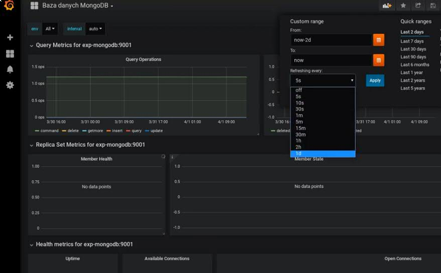

# Cwiczenie 7

## Cel
W tym ćwiczeniu dowiesz się jak używać interfejsu graficznego. Z Ciekawszych rzeczy dowiemy się jak wyświetlać różnice w poszczególnych wersjach dashboardów. Nauczymy się w jakis sposób dokonywać selekcji danych w wybranych ramach czasowych.

## Elemnty labotatorium

Tu znajdziecie ogólny zarys wymagań oraz elementów ćwiczenia:

+ Kontenery
  * vm-grafana

## Zaloguj się do Grafany:
Logujemy się za pomocą WebGui (admin:crc2019)

## Oglądamy film.
Kliknij poniższy link aby wyświetlić film.

Interfejs graficzny posiada cały szereg udogodnień. Można go rozbudowywać instalując dodatkowe pluginy/moduły. WebGui jest świetnym pomysłem gdy trzeba zrobić coś od podstaw. Nie mniej jednak aby zautomatyzować pewne zadania administracyjne zachęcam do skorzystania z wbudowanego REST API.

