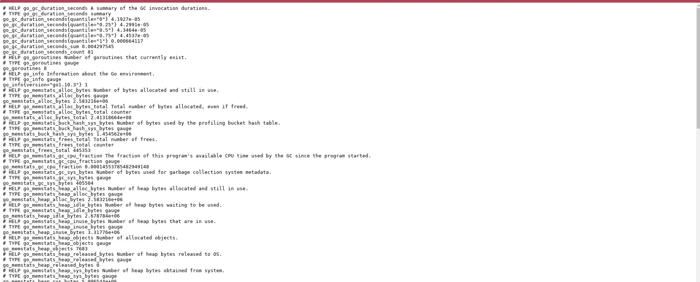
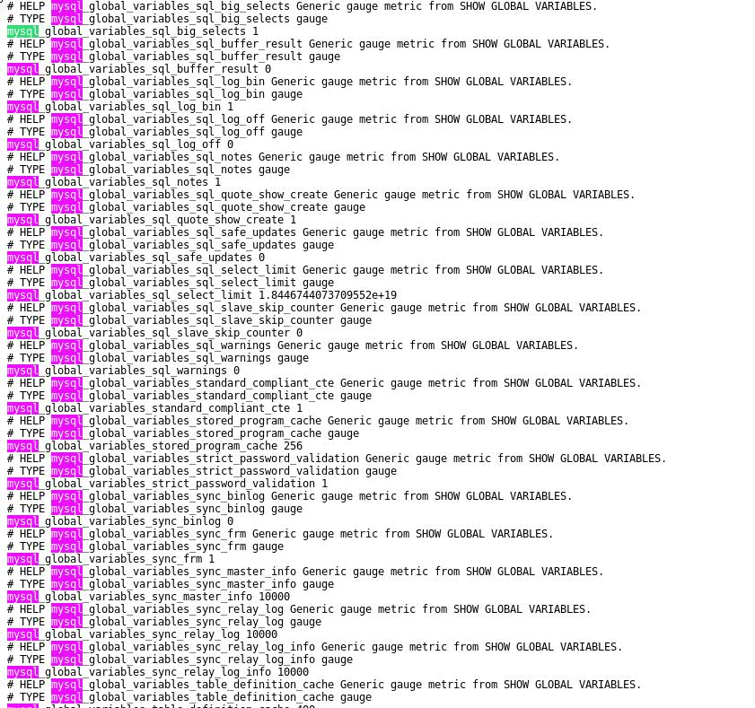

# Cwiczenie 8

## Cel
Celem Cwiczenia jest zapoznanie się z podstawowymi funkcjami prometheus oraz skonfigurowanie exportera dla MySQL/MariaDB

## Wprowadzenie
Bazy danych tak jak inne elementy infrastruktury wymagają ciągłego nadzoru oraz monitorowania. Istnieje szereg narzędzi służących do monitorowania serwerów SQL. Jednym z nich jest prometheus.
Dzięki mysql exporterowi możemy w prosty sposób zbierać wszystkie dane statystyczne dotyczące serwera oraz pobierać do centralnego serwera Prometheus.

## Elementy laboratorium

Tu znajdziecie ogólny zarys wymagań oraz elementów ćwiczenia:

+ Kontenery
  * vm-grafana
  * vm-mariadb
  * exp-mariadb

+ Skrypt sql/uprawnienia.sh

## Nadajemy uprawnienia niezbędne do tego by mysql exporter był w stanie przeczytać metryki serwera MySQL.
```
docker cp sql/uprawnienia.sql vm-mariadb:/tmp/uprawnienia.sql
```

docker exec -it vm-mariadb bash -c "mysql -u root -pcrc2019 </tmp/uprawnienia.sql"

`MySQL exporter działa nie mniej jednak nie mając odpowiednich uprawnień w bazie, którą ma monitorować nie jest w stanie wyświetlić danych odnośnie ilości zapytań obciążenia silnika bazy danych itp.`

## Weryfikacja

Logujemy się do bazy danych oraz sprawdzamy nadane uprzednio uprawnienia:
```
$ docker exec -it vm-mariadb bash -c "mysql -u root -pcrc2019"
Welcome to the MariaDB monitor.  Commands end with ; or \g.
Your MariaDB connection id is 173
Server version: 10.3.13-MariaDB-1:10.3.13+maria~bionic mariadb.org binary distribution

Copyright (c) 2000, 2018, Oracle, MariaDB Corporation Ab and others.

Type 'help;' or '\h' for help. Type '\c' to clear the current input statement.

MariaDB [(none)]>

MariaDB [(none)]>  SELECT HOST,USER,PASSWORD,Select_priv FROM mysql.user;
+----------------+----------+-------------------------------------------+-------------+
| HOST           | USER     | PASSWORD                                  | Select_priv |
+----------------+----------+-------------------------------------------+-------------+
| localhost      | root     | *4EA9A5190E9B2E06D2C11A2ED01C42AC0ADEE899 | Y           |
| exp-mariadb    | exporter | *4EA9A5190E9B2E06D2C11A2ED01C42AC0ADEE899 | Y           |
| %              | root     | *4EA9A5190E9B2E06D2C11A2ED01C42AC0ADEE899 | Y           |
| 10.200.200.151 | exporter | *4EA9A5190E9B2E06D2C11A2ED01C42AC0ADEE899 | Y           |
+----------------+----------+-------------------------------------------+-------------+
4 rows in set (0.000 sec)

MariaDB [(none)]> exit
Bye
$
```

W przeglądarce wpisujemy http://<docker[0-25]>.devops.crc:9104/

<br/>

Niestety zmiany będą widocznie dopiero po zrestartowaniu exportera.



Restartujemy kontener exp-mariadb
```
docker restart exp-mariadb
```


Jak widać restart nic nie pomógł :) Spróbujmy zdiagnozować nasz problem.

```
docker logs exp-mariadb
time="2019-03-21T18:24:27Z" level=error msg="Error pinging mysqld: Error 1045: Access denied for user '\"exporter'@'10.200.200.151' (using password: YES)" source="exporter.go:119"
time="2019-03-21T18:24:32Z" level=error msg="Error pinging mysqld: Error 1045: Access denied for user '\"exporter'@'10.200.200.151' (using password: YES)" source="exporter.go:119"
time="2019-03-21T18:24:37Z" level=error msg="Error pinging mysqld: Error 1045: Access denied for user '\"exporter'@'10.200.200.151' (using password: YES)" source="exporter.go:119"
time="2019-03-21T18:24:42Z" level=error msg="Error pinging mysqld: Error 1045: Access denied for user '\"exporter'@'10.200.200.151' (using password: YES)" source="exporter.go:119"
time="2019-03-21T18:24:47Z" level=error msg="Error pinging mysqld: Error 1045: Access denied for user '\"exporter'@'10.200.200.151' (using password: YES)" source="exporter.go:119"
time="2019-03-21T18:24:52Z" level=error msg="Error pinging mysqld: Error 1045: Access denied for user '\"exporter'@'10.200.200.151' (using password: YES)" source="exporter.go:119"
time="2019-03-21T18:24:57Z" level=error msg="Error pinging mysqld: Error 1045: Access denied for user '\"exporter'@'10.200.200.151' (using password: YES)" source="exporter.go:119"
time="2019-03-21T18:25:02Z" level=error msg="Error pinging mysqld: Error 1045: Access denied for user '\"exporter'@'10.200.200.151' (using password: YES)" source="exporter.go:119"
```

Jak widać z jakiegoś powodu konfiguracja nie została odświeżona. Spróbujmy to naprawić:

```
$ docker exec -it vm-mariadb bash -c "mysql -u root -pcrc2019"
Welcome to the MariaDB monitor.  Commands end with ; or \g.
Your MariaDB connection id is 329
Server version: 10.3.13-MariaDB-1:10.3.13+maria~bionic mariadb.org binary distribution

Copyright (c) 2000, 2018, Oracle, MariaDB Corporation Ab and others.

Type 'help;' or '\h' for help. Type '\c' to clear the current input statement.

MariaDB [(none)]> flush privileges;
Query OK, 0 rows affected (0.000 sec)
```

Restartujemy kontener exportera:

```
$ docker restart exp-mariadb
```

Sprawdzamy logi:
```
time="2019-03-21T22:37:41Z" level=info msg="Starting mysqld_exporter (version=0.11.0, branch=HEAD, revision=5d7179615695a61ecc3b5bf90a2a7c76a9592cdd)" source="mysqld_exporter.go:206"
time="2019-03-21T22:37:41Z" level=info msg="Build context (go=go1.10.3, user=root@3d3ff666b0e4, date=20180629-15:00:35)" source="mysqld_exporter.go:207"
time="2019-03-21T22:37:41Z" level=info msg="Enabled scrapers:" source="mysqld_exporter.go:218"
time="2019-03-21T22:37:41Z" level=info msg=" --collect.global_variables" source="mysqld_exporter.go:222"
time="2019-03-21T22:37:41Z" level=info msg=" --collect.slave_status" source="mysqld_exporter.go:222"
time="2019-03-21T22:37:41Z" level=info msg=" --collect.info_schema.tables" source="mysqld_exporter.go:222"
time="2019-03-21T22:37:41Z" level=info msg=" --collect.global_status" source="mysqld_exporter.go:222"
time="2019-03-21T22:37:41Z" level=info msg="Listening on :9104" source="mysqld_exporter.go:232"
```

Udało się błąd już nie występuje. Sprawdzamy czy metryki dla MariaDB są już widoczne. W związku z tym z poziomu przeglądarki wpisujemy następujący adres url: http://<docker[0-25]>:9104/metrics



Jeżeli z jakiegoś powodu metryki dalej są niedosępne należy jeszcze raz prześledzić logi na obydwu:

```
docker logs vm-mariadb
docker logs exp-mariadb
```

Zaloguj się do grafany. Z listy dashboardów wybierz ten, który odpowiada bazie danych MariaDB. Ustaw zakres danych na "5 ostatnich minut".
Wnioski? Działa?

### Jeżeli z jakiegoś powodu nie byłeś w stanie wykonać tego ćwiczenia użyj skryptu.
```
~./cwiczenia/8/wykonaj.sh
```

[](../../cwiczenia/7/cwiczenie7.md)
[](../../cwiczenia/9/cwiczenie9.md)
