# Cwiczenie 9

## Cel
Celem ćwiczenia jest pokazanie alternatywnego sposobu monitorowania systemów z użyciem telegraf. Skonfigurujemy nowe źródło danych oraz pdłączymy je do grafany.
Krok po kroku skonfigurujemy telegraf jako przekaźnik danych dla 2 kontenerów poniższym laboratorium. W celu zaprezentowania wyników ćwiczenia wczytamy wcześniej przygotowany dashboard. Dashboard będzie widoczny tylko i wyłącznie dla organizacji "Grupa2".

## Elemnty labotatorium

Tu znajdziecie ogólny zarys wymagań oraz elementów ćwiczenia:

+ Kontenery
  * vm-grafana
  * vm-influxdb
  * vm3-os
  * vm4-os


## Weryfikacja kontenerów oraz poszczególnych elementów laboratorium:

Po zalogowaniu na serwer z dockerem z poziomu użytkownika student wpisujemy:
```
docker ps -a | egrep "vm-grafana|vm-influxdb|vm3-os|vm4-os"
```

*Jeżeli kontenery nie wystartowały lub nie są uruchomione należy jak najszybciej powiadomić instruktora*

Wylistuj zawartość katalogu: cwiczenia/9

```
total 124
drwxrwxr-x.  5 student student  4096 Mar 21 13:45 .
drwxrwxr-x. 10 student student  4096 Mar 21 07:54 ..
drwxrwxr-x.  2 student student  4096 Mar 21 10:05 conf
-rw-rw-r--.  1 student student  8728 Mar 21 15:19 cwiczenie9.md
drwxrwxr-x.  2 student student  4096 Mar 21 09:23 src
drwxr-xr-x.  2 student student  4096 Mar 21 13:45 wczytaj
-rwxr-xr-x.  1 student student 92620 Mar 21 14:14 wykonaj.sh

```

Jeżeli zawartość jest zgodna można przejść do cześci praktycznej ćwiczenia.

## Tworzenie źródła danych

### Przygotowanie źródła danych
Inicjalizację bazy danych "telegraf" przeprowadzimy za pomocą API. W tym celu posłużymy się narzędziem curl. Jest ono dostępne praktycznie w każdym systemie i nie wymaga dodatkowej dodatkowej istalacji. Z poziomu użytkownika student wykonujemy następujące polecenie:
```
curl -XPOST 'http://vm-influxdb:8086/query' --data-urlencode 'q=CREATE DATABASE "telegraf"'
```

### Weryfikacja
Aby upewnić się, że baza telegraf została poprawnie stworzona wykonujemy poniższe polecenie:
```
curl -XPOST 'http://vm-influxdb:8086/query' --data-urlencode 'q=SHOW DATABASES' | jq '.'
```
Wynik polecenia powinien wyglądać mniej więcej jak ten poniżej:

```
% Total    % Received % Xferd  Average Speed   Time    Time     Time  Current
                               Dload  Upload   Total   Spent    Left  Speed
100   152    0   134  100    18  21689   2913 --:--:-- --:--:-- --:--:-- 22333
{
"results": [
  {
    "statement_id": 0,
    "series": [
      {
        "name": "databases",
        "columns": [
          "name"
        ],
        "values": [
          [
            "_internal"
          ],
          [
            "monitor"
          ],
          [
            "telegraf"
          ]
        ]
      }
    ]
  }
]
}
```
Jq przydaje się podczas przeszukiwania dużych plików zapisanych w formacie json. My użyliśmy go tylko do tego by sformatować wynik zapytania. Dzięki temu wynik jest bardziej czytelny. Jq potrafi również kolorować składnię na podstawie zagnieżdżeń co jest kolejnym atutem przemawiającym za tym by go używać.

Jeżeli nie jesteś fanem curl'a zawsze możesz użyć tradycyjnej metody a mianowicie:
```
[student@docker ~]$ docker exec -it vm-influxdb influx --execute 'show databases'
name: databases
name
----
_internal
monitor
telegraf
[student@docker ~]$
```

Powyższe polecenie wykonaliśmy bezpośrednio w kontenerze bez konieczności podłaczenia aktywnej sesji.

### Ustawienie hasła oraz użytkownika oraz nadanie uprawnień:

Tworzymy użytkownika telegraf oraz nadajemy uprawnienia do bazy danych:

```
curl "http://vm-influxdb:8086/query" --data-urlencode "q=CREATE USER telegraf WITH PASSWORD 'crc2019'" | jq '.'
curl "http://vm-influxdb:8086/query" --data-urlencode "q=GRANT ALL ON telegraf TO telegraf" | jq '.'
```

`Komendy tak jak poprzednio wykonujemy z użytkownika student na maszynie gdzie uruchomiony jest doscker serwer.`

W obu przypadkach komendy powinny zwrócic następjącą wartość:
```
{
  "results": [
    {
      "statement_id": 0
    }
  ]
}
```

Weryfikacja:
```
$ curl -XPOST 'http://vm-influxdb:8086/query' --data-urlencode 'q=SHOW USERS' | jq '.'
  % Total    % Received % Xferd  Average Speed   Time    Time     Time  Current
                                 Dload  Upload   Total   Spent    Left  Speed
100   117    0   103  100    14   8799   1196 --:--:-- --:--:-- --:--:--  9363
{
  "results": [
    {
      "statement_id": 0,
      "series": [
        {
          "columns": [
            "user",
            "admin"
          ],
          "values": [
            [
              "telegraf",
              false
            ]
          ]
        }
      ]
    }
  ]
}
```

```
$ curl -XPOST 'http://vm-influxdb:8086/query' --data-urlencode 'q=SHOW GRANTS FOR telegraf' | jq '.'
  % Total    % Received % Xferd  Average Speed   Time    Time     Time  Current
                                 Dload  Upload   Total   Spent    Left  Speed
100   154    0   122  100    32  19889   5216 --:--:-- --:--:-- --:--:-- 24400
{
  "results": [
    {
      "statement_id": 0,
      "series": [
        {
          "columns": [
            "database",
            "privilege"
          ],
          "values": [
            [
              "telegraf",
              "ALL PRIVILEGES"
            ]
          ]
        }
      ]
    }
  ]
}
```

### Podłączenie źródła danych w grafanie oraz test połączenia.
Po utworzeniu bazy danych oraz nadaniu uprawnień przyszedł czas na podłączenie źródła danych w grafanie. Postępuj zgodnie z poniższą recepturą:

Używając WebGui zaloguj się do grafany za pomocą użytkownika:

użytkownik: administrator<br/>
hasło: crc2019

Z menu głównego "Tryb" → "Data Sources":<br/>
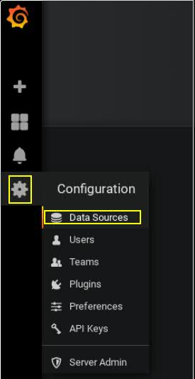

Zakładka "Data Sources" klikamy "Add data source":<br/>
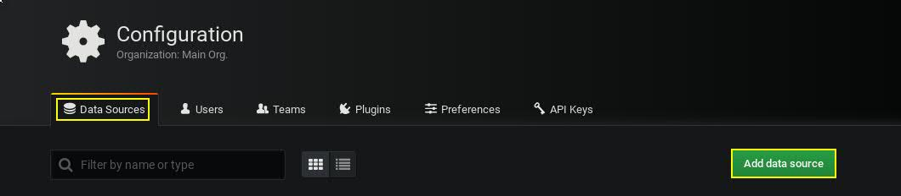

Wybieramy typ źródła danych:<br/>
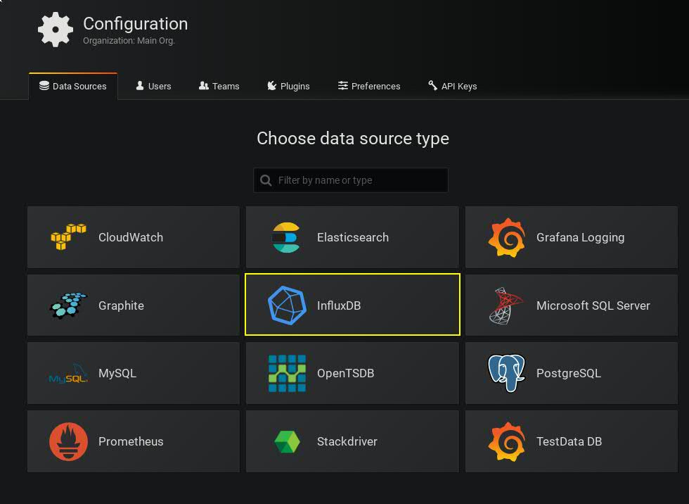

Uzupełniamy formularz:<br/>
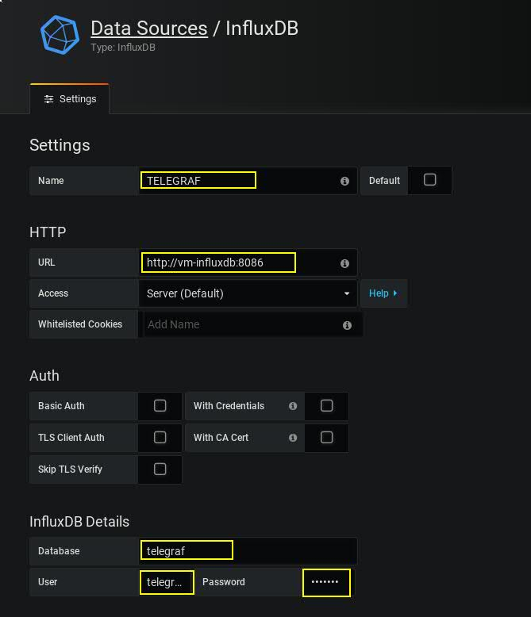

Klikamy "Save & Test":<br/>
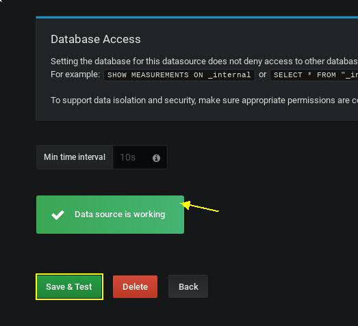

## Konfiguracja telegraf
Aby móc w pełni korzystać z przygotowanego wcześniej źródła danych potrzebujemy danych.
Danych dostarczy nam telegraf (agent) uruchomiony bezpośredni w kontenerach vm3-os i vm4-os.

### Przygotowanie pliku konfiguracyjnego, wstępne omówienie parametrów
Plik konfiguracyjny został przygotowany wcześniej. Kluczowe są linie, które nie zawierają
komentarzy. Najważniesze sekcje to global_tags, agent, outputs.influxdb oraz wszystkie pochodne
inputs.*

Aby wczytać plik bezpośrednio na kontenerze należy go uprzednio skopiować. W tym celu wykonujemy poniższą czynność:

```
$ pwd
/home/student/lab/cwiczenia/9/conf
$ docker cp conf/telegraf.conf vm3-os:/etc/
$ docker cp conf/telegraf.conf vm4-os:/etc/
$ docker exec -it vm3-os bash -c "head /etc/telegraf.conf"
#
# Ćwiczenie 9 - Konfiguracja telegraf jako alternatywa dla node exportera.
#

# Telegraf Configuration
#
# Telegraf is entirely plugin driven. All metrics are gathered from the
# declared inputs, and sent to the declared outputs.
#
# Plugins must be declared in here to be active.
$ docker exec -it vm4-os bash -c "head /etc/telegraf.conf"
#
# Ćwiczenie 9 - Konfiguracja telegraf jako alternatywa dla node exportera.
#

# Telegraf Configuration
#
# Telegraf is entirely plugin driven. All metrics are gathered from the
# declared inputs, and sent to the declared outputs.
#
# Plugins must be declared in here to be active.
```

Jak widać udało nam się skopiować nową konfigurację bezpośrednio do kontenerów. Aby zmiany zostały odnotowane,
należy zrestartować oba kontenery:

```
$ docker container restart vm3-os
vm3-os
$ docker container restart vm4-os
vm4-os
$ docker ps -a | egrep "vm3-os|vm4-os"
57eb4f203419        crcdevops/telegraf:latest        "telegraf"               16 hours ago        Up 28 seconds                                                                                                                                                                vm4-os
ed75de685681        crcdevops/telegraf:latest        "telegraf"               16 hours ago        Up 37 seconds                                                                                                                                                                vm3-os
```

### Weryfikacja poprawności przesyłanych danych
Po ponownym uruchomieniu kontenerów vm3-os i vm4-os telegraf zacznie przesyłać dane bezpośrednio do bazy danych influxdb. Jak to zweryfikować:

```
docker exec -it vm-influxdb influx --execute 'show series on telegraf'
docker exec -it vm-influxdb influx --execute 'show measurements on telegraf'
```

## Wczytanie grafu dla vm3-os i vm4-os
Po zalogowaniu się do grafany z poziomu użytkownika "administrator" tworzymy folder "wlasne". W kolejnym punkcie importujemy graf tak jak w cwiczeniu 3. Należy zaimportować plik wczytaj/Telegraf-hosts.jsonData

Tworzymy folder "wlasne":<br/>
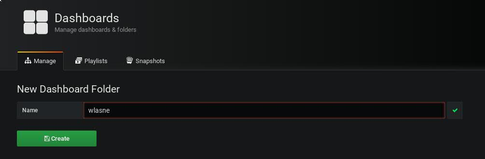
<br/><br/>
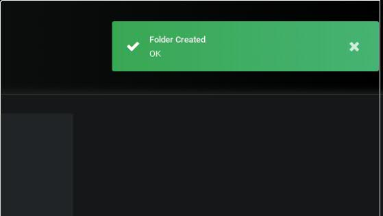
Wczytujemy dashboard<br/>
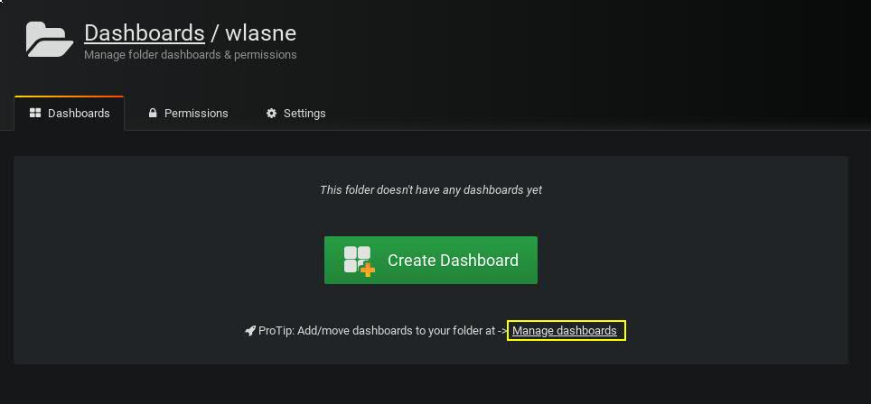
<br/><br/>
Wskazujemy plik dashboardu do zaimportowania (/home/student/lab/cwiczenia/8/wczytaj/Telegraf-hosts.json)<br/>
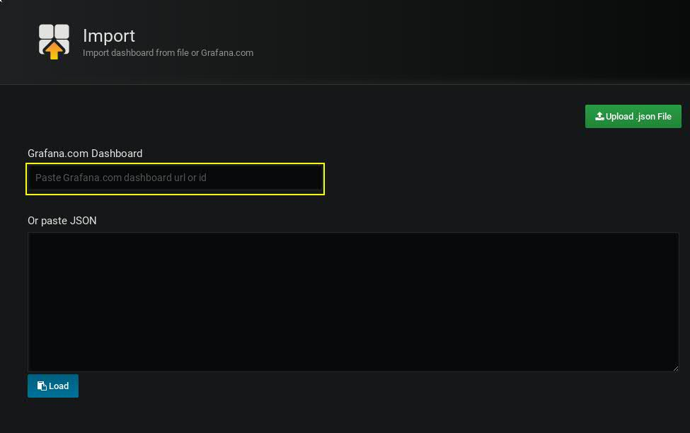
<br/><br/>
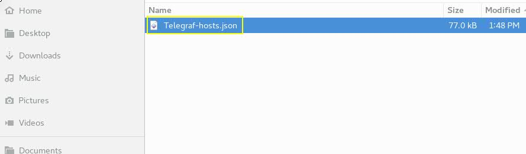
<br/><br/>
Wskazujemy folder do którego ma zostać przyporządkowany dashboard<br/>
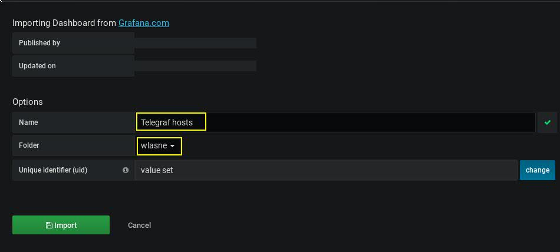


### Weryfikacja
Logujemy się na użytkownika tszybki, oraz jkowalski. Sprawdzamy czy dashboard jest widoczny. Wnioski? Przemyślenia?. Dashboard oraz datasource powinien byc widoczny tylko w obrębie organizacji Grupa2. Tylko administrator oraz gosc mają do nich dostęp!

Uwaga!
To ćwiczenie pokazuje w jaki sposób ograniczać dostęp do obiektów na podstawie dziedziczenia uprawnień (przynależność do grupy kreatora obiektów).


### Jeżeli z jakiegoś powodu nie byłeś w stanie wykonać tego ćwiczenia użyj skryptu.
```
~./cwiczenia/9/wykonaj.sh
```

[](../../cwiczenia/8/cwiczenie8.md)
[](../../cwiczenia/10/cwiczenie10.md)
